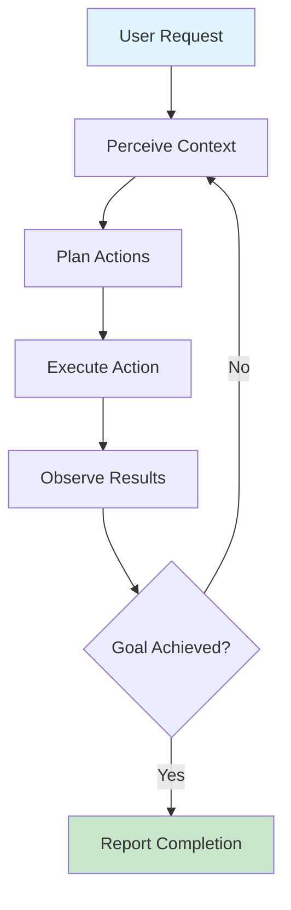

# Agentic AI

 This work is licensed under a <a rel="license" href="http://creativecommons.org/licenses/by/4.0/">Creative Commons Attribution 4.0 International License</a>.

## What is Agentic AI?

"Agents" or "Agentic" AI systems are LLM-powered assistants that can take **multiple autonomous actions** when given prompts or tasks. Unlike traditional conversational AI that simply responds to queries, agentic AI can:

- **Execute specific tasks** independently with minimal supervision
- **Reflect and reason** about problems through multi-step thinking processes
- **Make decisions** based on context, predictions, and classifications
- **Interact with tools and systems** to accomplish complex workflows
- **Adapt their approach** based on feedback and results

## Key Characteristics of Agentic AI

### Autonomy
Agentic AI can break down complex requests into subtasks and execute them without requiring step-by-step human guidance. For example, when asked to "fix the bug in the checkout flow," an agentic system might:

1. Search the codebase for checkout-related files
2. Identify potential issues by analyzing error patterns
3. Propose and implement fixes
4. Run tests to verify the solution
5. Document the changes made

### Tool Use and Integration
Modern agentic AI systems can interact with external tools, APIs, and systems. This is where **[Model Context Protocol (MCP)](mcp.md)** becomes crucial. MCP allows AI agents to:

- Access file systems and databases
- Execute code and terminal commands
- Interact with version control systems like Git
- Connect to web services and APIs
- Read and modify application state

See our [MCP documentation](mcp.md) for detailed information on how this protocol enables sophisticated agentic behaviors.

### Iterative Problem-Solving
Rather than providing a single response, agentic AI can iterate on solutions. It may:

- Try an approach, evaluate the results, and adjust
- Request additional context when needed
- Backtrack and try alternative strategies
- Learn from errors within a session

### Multi-Step Reasoning
Agentic systems often employ chain-of-thought reasoning, breaking problems into logical steps and maintaining context across a sequence of operations. This is particularly evident in modern coding assistants during **[vibe coding](vibe.md)** workflows.

## Agentic AI in Practice: Vibe Coding

The term **["vibe coding"](vibe.md)** describes one of the most prominent applications of agentic AI today—where developers collaborate with AI agents directly in their development environment. Modern agentic coding tools include:

- **[:simple-anthropic: Claude Code](vibe.md#claude-code-vs-code-extension)** - VS Code extension with autonomous coding capabilities
- **[:material-cursor-default-click: Cursor](vibe.md#cursor)** - Standalone editor with powerful agentic features
- **[:material-robot: Cline](vibe.md#cline)** - Open-source VS Code extension pioneering "bring your own model" approach
- **[:octicons-copilot-16: GitHub Copilot](vibe.md#github-copilot)** - Integrated agentic coding with GitHub workflows
- **[:material-surfing: Windsurf](vibe.md#windsurf)** - Standalone editor with agentic inline features

These tools demonstrate agentic behavior by:

- **Reading multiple files** to understand project context
- **Making coordinated changes** across multiple files
- **Running commands** in the terminal to test changes
- **Debugging errors** and iterating on solutions
- **Suggesting architectural improvements** based on codebase analysis

Learn more about these tools in our [Vibe Coding guide](vibe.md).

## How Agentic AI Works: The Agent Loop

Agentic AI typically operates using a **perception-decision-action loop**:

1. **Perceive**: Gather context from the environment (code, files, system state)
2. **Plan**: Determine what actions are needed to accomplish the goal
3. **Execute**: Perform the action using available tools
4. **Observe**: Evaluate the results and any errors
5. **Iterate**: Continue until the goal is met or help is needed

## Enabling Technologies

### Model Context Protocol (MCP)
**[MCP](mcp.md)** is foundational for modern agentic AI systems. It provides:

- **Standardized context access** across different applications
- **Tool invocation capabilities** for executing actions
- **Real-time application state** awareness
- **Cross-application coordination** potential

Without MCP or similar protocols, AI agents would be limited to conversational assistance. MCP enables them to "see" your work environment and "act" within it. Read our [comprehensive MCP guide](mcp.md) to understand how this works.

### Function Calling / Tool Use
Most modern LLMs support structured function calling, allowing them to:

- Invoke APIs with specific parameters
- Execute predefined workflows
- Query databases or search engines
- Interact with external services

### Extended Context Windows
Larger context windows (200K+ tokens) enable agents to:

- Maintain awareness of entire projects
- Reference extensive documentation
- Track long conversation histories
- Analyze multiple files simultaneously

## Use Cases for Agentic AI

### Software Development
- **Automated code refactoring** across multiple files
- **Bug diagnosis and fixing** with minimal guidance
- **Test generation and execution**
- **Documentation creation** from code analysis
- **Code review and suggestions** based on best practices

Related: See [Vibe Coding](vibe.md) for development-focused tools.

### Research and Data Analysis
- **Data scraping and preprocessing** from multiple sources
- **Automated literature reviews** with source synthesis
- **Statistical analysis** with iterative refinement
- **Visualization generation** and iteration
- **Report generation** from raw data

### Content Creation
- **Multi-format content generation** (blog posts, social media, scripts)
- **Iterative editing** based on style guidelines
- **Research and fact-checking** during writing
- **SEO optimization** with keyword analysis

### System Administration
- **Log analysis and troubleshooting**
- **Automated deployment workflows**
- **Configuration management**
- **Security auditing** and remediation

### Creative Work
- **Iterative design exploration** in design tools
- **3D modeling assistance** with context awareness
- **Music and art generation** with style consistency
- **Creative brainstorming** with research integration

## The Future of Agentic AI

As agentic AI systems become more sophisticated, we're seeing:

- **Multi-agent systems** where specialized agents collaborate
- **Longer-running agents** that work on tasks over hours or days
- **Cross-application coordination** via protocols like [MCP](mcp.md)
- **Improved safety mechanisms** for autonomous operations
- **Better user control** over agent autonomy levels

The combination of **[vibe coding tools](vibe.md)**, **[MCP integration](mcp.md)**, and increasingly capable LLMs is creating a new paradigm where AI agents become true collaborators in complex workflows.

## Getting Started with Agentic AI

To experience agentic AI firsthand:

1. **Try vibe coding**: Install [Claude Code](vibe.md#claude-code-vs-code-extension) or [Cursor](vibe.md#cursor) and experience agentic coding assistance
2. **Explore MCP**: Set up [Claude Desktop](https://claude.ai/download){target=_blank} with [MCP servers](mcp.md) to see context-aware assistance
3. **Experiment with prompting**: Practice breaking down complex tasks and letting the AI agent iterate on solutions
4. **Learn the tools**: Explore the various [vibe coding platforms](vibe.md) to find the best fit for your workflow

## Best Practices for Working with Agentic AI

- **Start with clear goals**: Give agents well-defined objectives
- **Monitor progress**: Check in on agent actions, especially when learning
- **Provide feedback**: Correct course when the agent goes astray
- **Understand limitations**: Know when to take manual control
- **Security awareness**: Be cautious with agents that can execute code or access sensitive systems
- **Iterate on prompts**: Refine your instructions based on agent behavior

!!! warning "Security Considerations"
    Agentic AI systems that can execute code, access files, or interact with systems require careful security consideration. Always:

    - Review code before execution in sensitive environments
    - Use appropriate sandboxing and permissions
    - Follow your institution's security policies
    - Be aware of what tools and systems your AI agent can access

    Learn more in our [Vibe Coding security warnings](vibe.md#security-considerations).

## Further Resources

- **[Vibe Coding Guide](vibe.md)** - Comprehensive overview of agentic coding tools
- **[Model Context Protocol (MCP)](mcp.md)** - Deep dive into the protocol enabling agentic behaviors
- **[AI Landscape](ai_landscape.md)** - Broader context on AI capabilities and models
- **[Anthropic's Claude](https://docs.anthropic.com)** - Documentation for one of the leading agentic AI systems
- **[LangChain Agents](https://python.langchain.com/docs/modules/agents/)** - Framework for building custom agentic systems  