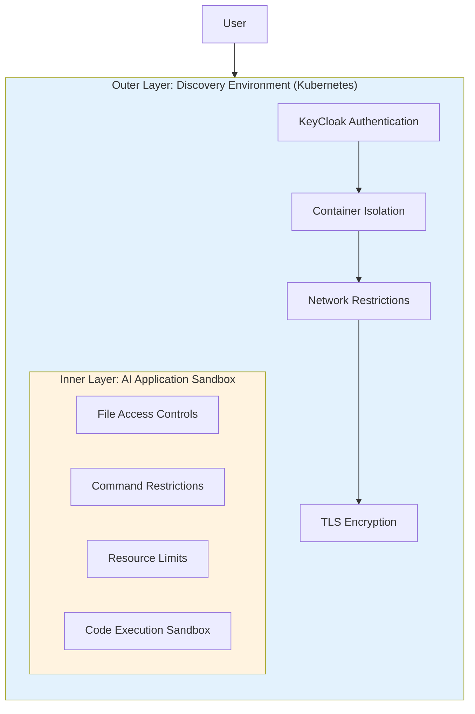
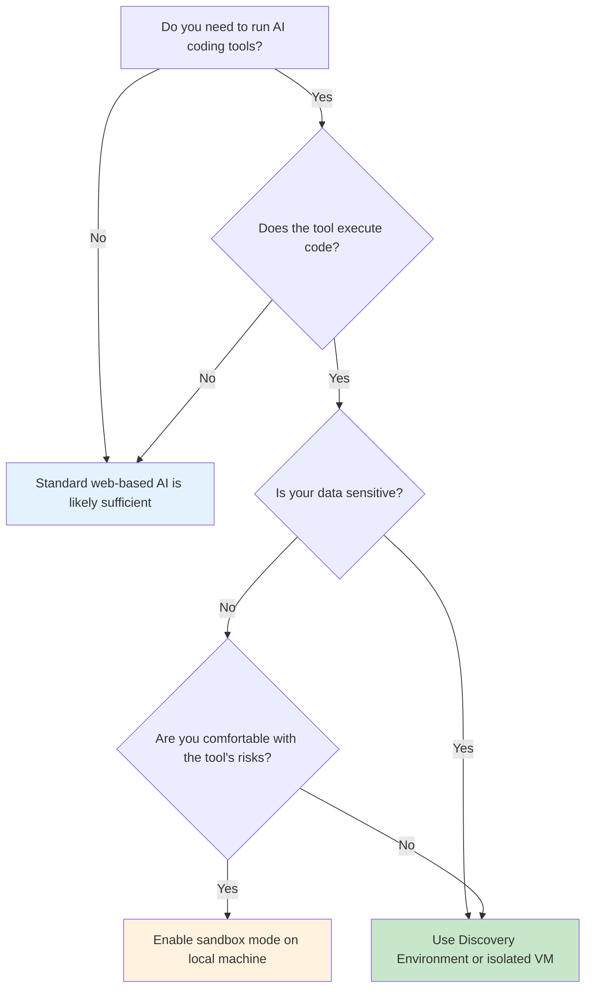

# AI Sandboxes

<a rel="license" href="http://creativecommons.org/licenses/by/4.0/"></a><br />This work is licensed under a <a rel="license" href="http://creativecommons.org/licenses/by/4.0/">Creative Commons Attribution 4.0 International License</a>.

## What is an AI Sandbox?

An **AI sandbox** is a controlled, isolated environment where AI tools can operate safely without risking your personal data, system files, or computer stability. The term "sandbox" comes from the idea of a child's sandbox: a contained play area where activities cannot affect the world outside.

There are two distinct types of AI sandboxes:

1. **Traditional Sandboxes** - Virtual machines and containers that isolate entire computing environments
2. **Agentic AI Sandboxes** - Built-in safety features within AI coding assistants that restrict what the AI can do on your computer

Understanding the difference is essential for safely working with modern AI tools, especially those that can execute code or modify files.

---

## Traditional Sandboxes

Traditional sandboxes have been used in computing for decades to isolate software and protect systems. These create a separate computing environment where programs run in isolation from your main system.

### What Are Traditional Sandboxes?

Traditional sandboxes use **virtualization** or **containerization** to create isolated environments:

| Technology | Description | Isolation Level |
|------------|-------------|-----------------|
| **Virtual Machines (VMs)** | Complete simulated computers with their own operating system | High - full hardware isolation |
| **Containers** | Lightweight isolated environments sharing the host OS kernel | Medium - process isolation |
| **Development Containers** | Containerized development environments (e.g., VS Code Dev Containers) | Medium - with IDE integration |

### Key Characteristics

Traditional sandboxes provide protection through:

- **File system isolation** - The sandbox cannot access files outside its designated area
- **Network isolation** - Control over what network resources the sandbox can reach
- **Resource constraints** - Limits on CPU, memory, and disk usage prevent system crashes
- **Process isolation** - Programs inside cannot interact with programs outside

### When to Use Traditional Sandboxes

Traditional sandboxes are ideal for:

- Running untrusted software or code
- Testing potentially risky AI-generated code before deploying it
- Working with sensitive data that should not leave a controlled environment
- Experimenting with new AI tools without risking your main system

!!! tip "Recommendation for AI Experimentation"
    If you are experimenting with AI tools that execute code, consider running them inside a virtual machine or container first. This provides an extra layer of protection while you learn how the tools behave.

### UA Resources for Traditional Sandboxes

The University of Arizona provides managed cloud services that support traditional sandbox environments:

- **[Managed Cloud Services](https://it.arizona.edu/managed-cloud-services){target=_blank}** - AWS-based virtual machines and development environments
- **CyVerse Discovery Environment** - Container-based computing platform (see below)

---

## Agentic AI Sandboxes

Agentic AI sandboxes are a newer concept that emerged with the rise of AI coding assistants like Claude Code, OpenAI Codex, and Gemini CLI. These tools can read files, write code, and execute commands on your computer, which creates significant security considerations.

### What Are Agentic AI Sandboxes?

Unlike traditional sandboxes that isolate entire environments, agentic AI sandboxes are **built-in safety features** within the AI application itself. They restrict what the AI agent can do when running on your computer.

!!! info "Key Difference"
    **Traditional sandbox:** Isolates the entire computing environment from your system

    **Agentic AI sandbox:** Restricts specific AI capabilities while the AI runs on your normal system

### How Agentic AI Sandboxes Work

When you enable sandbox mode in an agentic AI tool, it typically enforces:

| Protection | What It Does |
|------------|--------------|
| **Restricted system calls** | Limits permissions so the AI cannot perform dangerous operations (like deleting your hard drive) |
| **Limited file system access** | Restricts the AI to only access specific folders you designate |
| **Network isolation controls** | Controls whether the AI can access the internet or other programs |
| **Resource constraints** | Limits CPU, RAM, and disk usage to prevent system crashes |
| **Security boundaries** | Contains potentially malicious code to prevent it from escaping to your broader system |

### Commercial Agentic AI Tools with Sandbox Features

Several major AI coding assistants now include sandbox modes:

#### Claude Code

[:simple-anthropic: Claude Code](https://docs.anthropic.com/en/docs/claude-code){target=_blank} includes built-in sandboxing capabilities.

- **Documentation:** [Claude Code Sandboxing Guide](https://www.anthropic.com/engineering/claude-code-sandboxing){target=_blank}
- **Features:** Configurable file access, command restrictions, and approval workflows

#### OpenAI Codex

[:fontawesome-brands-openai: OpenAI Codex](https://openai.com/index/codex/){target=_blank} provides sandbox execution environments.

- Runs code in isolated containers
- Limited network access by default

#### Gemini CLI

[:simple-google: Gemini CLI](https://ai.google.dev/gemini-api/docs/get-started/tutorial){target=_blank} offers sandbox modes for safer execution.

- UA credentials work for authentication
- Configurable permission levels

!!! warning "Critical Security Consideration"
    Even with sandbox features enabled, you should understand what capabilities you are granting to AI tools. Sandboxes reduce risk but do not eliminate it entirely.

    **Always review AI-generated code before executing it in production environments.**

---

## Running AI Safely: Understanding the Risks

Before using any AI tool that can execute code or modify files, you need to understand the potential risks.

### What Can Go Wrong?

When you give an AI tool permission to execute code on your computer, several things can happen:

!!! danger "Potential Risks of Unrestricted AI Execution"

    - **Data Loss** - The AI could accidentally delete important files
    - **Privacy Exposure** - Sensitive data could be sent to external servers
    - **System Instability** - Poorly written code could crash your system
    - **Security Vulnerabilities** - The AI might install malicious packages or create security holes
    - **Compliance Violations** - Actions might violate institutional policies (FERPA, HIPAA, etc.)

### Levels of AI Tool Risk

| Risk Level | Description | Examples |
|------------|-------------|----------|
| **Low** | AI provides suggestions only; you execute manually | ChatGPT web chat, Claude web interface |
| **Medium** | AI can execute code in isolated browser environment | ChatGPT Code Interpreter, Google Colab |
| **High** | AI can execute code on your local machine | Claude Code, Cursor, Codex CLI |
| **Very High** | AI has unrestricted access to your system | Any tool with sandbox disabled |

### Best Practices for Safe AI Usage

1. **Start with restricted permissions** - Enable sandbox mode whenever available
2. **Review before executing** - Always read AI-generated code before running it
3. **Use dedicated environments** - Run risky operations in VMs or containers
4. **Limit file access** - Only grant access to project-specific folders
5. **Monitor activity** - Pay attention to what the AI is doing
6. **Keep backups** - Maintain backups of important data before AI experimentation

---

## The Discovery Environment: A Layered Security Approach

The University of Arizona's **Discovery Environment (DE)** provides a secure platform that combines traditional container isolation with the ability to run agentic AI tools. This creates a **layered security model** that offers stronger protection than running AI tools directly on your personal computer.

### What is the Discovery Environment?

The Discovery Environment is a Kubernetes-based platform that provides:

- **Secure, authenticated access** via KeyCloak identity management
- **Container isolation** - Each user session runs in its own Kubernetes pod
- **Network restrictions** - Limited to port 443 (HTTPS) only
- **TLS encryption** - All traffic encrypted via NGINX
- **GPU capabilities** - Access to GPU resources for AI workloads

!!! note "Important Clarification"
    The Discovery Environment is **not** a true AI sandbox by itself. However, it provides many sandbox-like features and serves as an excellent platform for running agentic AI sandboxes safely.

### The Layered Security Model

When you run a commercial AI application (like Claude Code or Codex) inside the Discovery Environment, you benefit from two layers of protection:



**Outer Layer (Discovery Environment):**

- Container isolation via Kubernetes pods
- KeyCloak authentication controls who can access
- Network restrictions limit exposure
- Process isolation between users

**Inner Layer (AI Application Sandbox):**

- The AI tool's own sandbox features
- File access restrictions
- Command execution controls
- Code isolation mechanisms

### Why This Matters

This layered approach provides significant advantages:

| Benefit | Description |
|---------|-------------|
| **Defense in depth** | If one layer fails, the other still provides protection |
| **Data protection** | Sensitive data on your personal laptop is not exposed |
| **Institutional compliance** | Easier to meet security and privacy requirements |
| **Recovery** | Container can be reset without affecting your personal system |
| **Audit capability** | Platform-level logging of activities |

---

## Using AI Sandboxes in the Discovery Environment

The Discovery Environment offers pre-configured applications for running agentic AI tools safely.

### Claude Code in Discovery Environment

[:simple-anthropic: Claude Code](https://docs.anthropic.com/en/docs/claude-code){target=_blank} is available in the featured CloudShell application.

**Setup:**

1. Launch the CloudShell application in the Discovery Environment
2. Install Claude Code with a single command:
   ```bash
   npm install -g @anthropic-ai/claude-code
   ```
3. Authenticate with your Anthropic account or API key:
   ```bash
   claude login
   ```

**Documentation:**

- [Claude Code Sandboxing](https://www.anthropic.com/engineering/claude-code-sandboxing){target=_blank}
- [Claude Code Documentation](https://docs.anthropic.com/en/docs/claude-code){target=_blank}

### OpenAI Codex in Discovery Environment

[:fontawesome-brands-openai: OpenAI Codex](https://openai.com/index/codex/){target=_blank} is also available in the CloudShell application.

**Setup:**

1. Launch the CloudShell application in the Discovery Environment
2. Install the OpenAI CLI:
   ```bash
   pip install openai
   ```
3. Authenticate with your OpenAI account or API key:
   ```bash
   export OPENAI_API_KEY="your-api-key"
   ```

### Gemini CLI in Discovery Environment

[:simple-google: Gemini CLI](https://ai.google.dev/gemini-api/docs/get-started/tutorial){target=_blank} works with UA credentials.

**Setup:**

1. Launch the CloudShell application in the Discovery Environment
2. Authenticate using your UA Google account
3. Configure Gemini CLI for your project

!!! tip "UA Credential Integration"
    University of Arizona personnel can use their UA credentials to authenticate with Gemini CLI, simplifying access management.

---

## AI Sandbox Landscape in Higher Education

Universities and major technology companies have recognized the importance of providing safe AI experimentation environments for students. This section explores the broader landscape of AI sandbox offerings beyond the University of Arizona, demonstrating how institutions worldwide are addressing the need for secure, accessible AI learning platforms.

### University-Hosted AI Sandbox Platforms

Many leading universities have developed their own AI sandbox environments to give students secure, ready-to-use platforms for AI exploration. These campus-hosted solutions range from web interfaces for generative AI tools to full computing clusters for coursework.

#### Harvard University - AI Sandbox

**What it is:** A secure web platform launched in 2023 that provides access to multiple large language models (including ChatGPT) within Harvard's network.

**Access:** Free for all Harvard undergraduates and faculty with Harvard login credentials. [Harvard AI Sandbox](https://www.huit.harvard.edu/ai-sandbox){target=_blank}

**Key Features:**

- Multiple LLM interfaces for experimentation
- Chat interface for code generation and text analysis
- Data protection (approved for [up to "Level 3" confidential data](https://www.huit.harvard.edu/tools-services-researchers){target=_blank} per Harvard policies)
- Ensures moderate-sensitivity data stays protected within Harvard's network

**Why it matters:** Harvard's approach demonstrates how institutions can provide secure AI access while maintaining data governance standards.

**Learn more:** [Harvard AI Sandbox](https://www.huit.harvard.edu/ai-sandbox){target=_blank}

#### Stanford University - AI Playground

**What it is:** Stanford's ["safer AI platform"](https://uit.stanford.edu/news/ai-playground-safer-ai-platform-stanford-community){target=_blank} launched in 2024-2025, providing free access to multiple AI models in a Stanford-controlled environment.

**Access:** Free for any Stanford affiliate (students, faculty, or staff) via Stanford login at [aiplayground.stanford.edu](https://uit.stanford.edu/aiplayground){target=_blank}.

**Key Features:**

- Multiple generative AI models (ChatGPT and others)
- Custom Stanford plugins for searching institutional resources
- Cleared for low- and moderate-risk Stanford data
- Slack community integration for collaboration
- Continuously evolving with new features

**Why it matters:** Stanford emphasizes security compliance, allowing students to experiment with AI while meeting data privacy requirements.

#### Princeton University - A.I. Sandbox

**What it is:** A [secure service](https://researchcomputing.princeton.edu/support/knowledge-base/ai-sandbox){target=_blank} enabling researchers and students to use large language models via both web chat UI and API, with integration to Princeton's HPC cluster.

**Access:** Controlled access - [faculty must sponsor and request accounts](https://researchcomputing.princeton.edu/support/knowledge-base/ai-sandbox){target=_blank} for students or research staff.

**Key Features:**

- Web chat interface and API access
- Integration with Princeton's HPC cluster for large-scale tasks
- Faculty oversight ensures academic use
- Can call AI models from cluster nodes for computation-intensive work

**Why it matters:** Princeton's faculty-sponsored model provides oversight while offering powerful computational integration for advanced research projects.

#### Georgia Tech - AI Makerspace

**What it is:** A ["digital sandbox"](https://coe.gatech.edu/news/2024/04/georgia-tech-unveils-new-ai-makerspace-collaboration-nvidia){target=_blank} unveiled in 2024 in collaboration with NVIDIA - essentially a **supercomputing cluster** dedicated to undergraduate AI instruction.

**Access:** Available to Georgia Tech engineering students as part of their curriculum at no cost.

**Key Features:**

- Enterprise-grade AI hardware: [20 NVIDIA HGX H100 servers (160 total H100 GPUs)](https://coe.gatech.edu/news/2024/04/georgia-tech-unveils-new-ai-makerspace-collaboration-nvidia){target=_blank}
- High-speed InfiniBand networking
- NVIDIA AI Enterprise software stack
- Support from NVIDIA's Deep Learning Institute (workshops, certifications)
- Enables realistic AI projects previously infeasible in normal computer labs

**Why it matters:** Represents a major investment in giving undergraduates access to cutting-edge hardware, preparing them for industry-scale AI development.

**Learn more:** [Georgia Tech AI Makerspace](https://coe.gatech.edu/academics/ai-for-engineering/ai-makerspace){target=_blank}

#### UC Berkeley - DataHub (JupyterHub)

**What it is:** [Campus-wide JupyterHub cloud service](https://cdss.berkeley.edu/datahub-home-page){target=_blank} developed for the "Data 8" course (Foundations of Data Science), now serving dozens of courses across disciplines.

**Access:** Free for Berkeley students enrolled in participating courses.

**Key Features:**

- Cloud-hosted Jupyter notebook environment (runs on Google Cloud Kubernetes)
- [Standard computing environment](https://cdss.berkeley.edu/datahub-home-page){target=_blank} with Python/R and ML libraries pre-configured
- Supports Jupyter notebooks, JupyterLab, R Studio, and VS Code interfaces
- Persistent storage for student work
- Highly scalable (handles 400+ concurrent users)
- Instructors can [distribute assignments via Git links](https://cdss.berkeley.edu/choosing-right-jupyterhub-infrastructure){target=_blank} that auto-launch notebooks

**Why it matters:** An [established platform](https://ucbds-infra.github.io/ds-course-infra-guide/jupyterhub/data8.html){target=_blank} (mid-2010s) that has inspired other universities to adopt similar JupyterHub setups. Demonstrates how traditional sandbox technology (containers) effectively supports AI and data science education.

!!! info "JupyterHub Adoption Across Universities"
    Many universities have adopted similar Jupyter-based sandboxes, including [University of Toronto](https://datatools.utoronto.ca/){target=_blank}, [Brown](https://ccv.brown.edu/services/classroom/){target=_blank}, University of Washington, and [Purdue](https://www.rcac.purdue.edu/knowledge/scholar/jupyter){target=_blank}. These provide standardized computing environments with Python/R and ML libraries for undergraduate AI and data science instruction.

#### Other Notable University Platforms

**Florida Atlantic University - [Gruber AI Sandbox](https://transcendtomorrow.fau.edu/articles/an-ai-research-hub-for-students/){target=_blank}**

- Physical makerspace in campus library (established 2019)
- Open-door access for all FAU students, faculty, and staff
- High-performance desktops with GPU power for deep learning
- Grad student mentors provide office hours support
- Interdisciplinary focus (biology, arts, business, etc.)

**Clemson University - [Launchpad AI Sandbox](https://www.clemson.edu/centers-institutes/launchpad/about/ai-center.html){target=_blank}**

- Dedicated to student startup teams developing AI models
- Competitive admission (4 active teams at a time)
- Each team gets equivalent of 1 NVIDIA A100 GPU
- Includes expert coaching, mentors, and networking opportunities
- Incubator model combining computing resources with business support

**UW Tacoma - [AI Sandbox](https://www.tacoma.uw.edu/business/cba/ai-sandbox){target=_blank} (Center for Business Analytics)**

- Apple Silicon workstation with AI software tools
- Reservation-based access for students and faculty
- Guided learning paths for beginners and advanced users
- Focus on business analytics applications

### Corporate-Sponsored AI Sandbox Programs

Major technology companies provide educational cloud sandbox programs to universities and students, ranging from free cloud credits to full curricula and managed class environments.

#### Amazon Web Services (AWS)

**[AWS Educate](https://aws.amazon.com/education/awseducate/){target=_blank}**

- **Access:** [Free for individual students](https://aws.amazon.com/education/awseducate/){target=_blank} (age 13+) with no credit card required
- **Delivery:** Cloud-based learning portal with self-paced courses and hands-on labs
- **Features:** No-cost "starter accounts" for experimenting with AWS services, curated learning paths on cloud/AI/ML, job board for students 18+
- **Target:** Undergraduate students worldwide beginning in cloud and AI
- **Longevity:** Established 2015, well-established program

**[AWS Academy](https://aws.amazon.com/training/awsacademy/){target=_blank}**

- **Access:** Universities apply to join (free); approved schools get ready-to-teach curricula
- **Delivery:** AWS provides course materials and AWS Academy Learner Lab environment
- **Features:** Full curriculum pathways aligned to [AWS certifications](https://aws.amazon.com/training/awsacademy/){target=_blank}, hands-on labs/projects, assessment tools, student credits for cloud work
- **Target:** Institutions offering cloud computing or AI courses (often MIS, IT, CS departments)
- **Longevity:** Growing since ~2018, includes Generative AI Foundations course (2023)

#### Google Cloud

**[Google Cloud for Students](https://cloud.google.com/edu/students){target=_blank} & [Teaching Credits](https://cloud.google.com/edu/faculty){target=_blank}**

- **Access:** Free \$300 trial for students; faculty can request [\$50/student + \$100/faculty](https://cloud.google.com/edu/faculty){target=_blank} for courses
- **Delivery:** Full Google Cloud Platform access
- **Features:** GCP services (AI APIs, BigQuery, Compute Engine), Google Cloud Skills Boost labs with free credits
- **Target:** Students in computing, data science, or courses introducing cloud/AI
- **Longevity:** Active since ~2018-2019, expanding with generative AI training (2023-2024)

**[Google Cloud Skills Boost](https://cloud.google.com/edu/students){target=_blank} (formerly Qwiklabs)**

- Online lab platform with catalog of cloud and AI labs
- Students get 200 free lab credits for hands-on exercises
- Labs run in temporary sandbox accounts
- Earn skill badges upon completion

#### Microsoft Azure

**[Azure for Students](https://azure.microsoft.com/en-us/free/students){target=_blank}**

- **Access:** Any full-time student 18+ at verified institution; [no credit card required](https://azure.microsoft.com/en-us/free/students){target=_blank}
- **Delivery:** Standard Azure cloud portal with "Azure for Students" subscription
- **Features:** [\$100 in Azure credit (renewable annually)](https://azure.microsoft.com/en-us/free/students){target=_blank}, 25+ free Azure products for 12 months, access to Azure OpenAI Service, GitHub Student benefits
- **Target:** Individual student developers and learners doing class projects
- **Longevity:** Established ~2017, widely used in university CS/IT programs

**[Azure Lab Services](https://azure.microsoft.com/en-us/products/lab-services){target=_blank}**

- **Access:** Institution/faculty needs Azure subscription (often uses educational grants/credits)
- **Delivery:** Managed cloud VMs for classroom use
- **Features:** Pre-configured VMs with custom software (e.g., TensorFlow, GPU-enabled), auto-shutdown, quota setting, [LMS integration (Canvas)](https://azure.microsoft.com/en-us/blog/azure-lab-services-august-2022-update-improved-classroom-and-training-experience/){target=_blank}
- **Target:** Courses needing custom environments (CS, data science, engineering)
- **Longevity:** Active since ~2018, [major revamp in 2022](https://azure.microsoft.com/en-us/blog/azure-lab-services-august-2022-update-improved-classroom-and-training-experience/){target=_blank}

#### IBM

**[IBM Academic Initiative](https://www.ibm.com/academic){target=_blank} & [SkillsBuild](https://skillsbuild.org/college-educators){target=_blank}**

- **Access:** Faculty and students register with institutional email
- **Delivery:** [IBM Cloud credits](https://www.ibm.com/products/cloud/free){target=_blank} (enhanced trial accounts), software downloads, IBM SkillsBuild online courses
- **Features:** IBM Cloud services (Watson AI APIs, Watson Studio, SPSS), courseware and tutorials, free IBM badges and certifications
- **Target:** Universities globally, especially business analytics and CS programs
- **Longevity:** Over 10 years, modernized through SkillsBuild platform

#### Oracle

**[Oracle Academy Cloud Program](https://academy.oracle.com/en/solutions-cloud.html){target=_blank}**

- **Access:** Institutions become Oracle Academy members (free); [educators request student accounts](https://academy.oracle.com/en/solutions-cloud.html){target=_blank}
- **Delivery:** Oracle Cloud Infrastructure with Always Free services + [\$300 credits/year per student](https://academy.oracle.com/pages/datasheets/Cloud%20Datasheet%20A4%20Electronic%20English.pdf){target=_blank}
- **Features:** Oracle Data Science notebooks (Jupyter), Autonomous Database with ML algorithms, AI services for language/vision
- **Target:** Students in institutions teaching Oracle technologies (database, Java, information systems)
- **Longevity:** Started ~2019, actively used worldwide

#### Databricks

**[Databricks Free Edition](https://www.databricks.com/product/faq/community-edition){target=_blank} & [University Alliance](https://www.databricks.com/university){target=_blank}**

- **Access:** Anyone can sign up for Free Edition; University Alliance for educators with teaching materials
- **Delivery:** Cloud-hosted Databricks workspace
- **Features:** Full Databricks experience (not demo version), data analytics and AI workflows, Spark and GenAI capabilities (MosaicML), collaborative notebooks, Databricks Academy training content
- **Target:** Students learning data science and AI; courses teaching Spark, ML, big data
- **Longevity:** University Alliance active for several years; Free Edition brand new (2025) with [\$100M education investment](https://www.prnewswire.com/news-releases/databricks-launches-free-edition-and-announces-100-million-investment-to-develop-the-next-generation-of-data-and-ai-talent-302478790.html){target=_blank}

### Comparison of AI Sandbox Offerings

The following table summarizes key characteristics of major AI sandbox programs for undergraduate education:

| **Provider** | **Program** | **Access Model** | **Delivery** | **Core Features** | **Target Users** | **Status** |
|--------------|-------------|------------------|--------------|-------------------|------------------|------------|
| **Harvard** | AI Sandbox | Free (Harvard login) | Cloud web app | Multiple LLMs, secure data handling | All undergrads & faculty | New (2023) |
| **Stanford** | AI Playground | Free (Stanford SSO) | Cloud web app | Open-source & ChatGPT models, moderate-risk data | Students, staff, faculty | New (2024) |
| **Georgia Tech** | AI Makerspace | Course-integrated (free) | On-prem HPC (160 H100 GPUs) | Supercomputer-grade GPU computing | Undergrad engineering | New (2024) |
| **UC Berkeley** | DataHub | Free for enrollees | Cloud (Kubernetes/GCP) | Jupyter/R notebooks, ML libs preloaded | Students in many courses | Established (~2015+) |
| **AWS** | AWS Educate | Free individual signup | AWS Cloud (managed labs) | Self-paced courses, no-CC sandbox | Global students & educators | Established (2015) |
| **AWS** | AWS Academy | Institution joins (free) | AWS Cloud (Academy portal) | Cloud curriculum + lab environment | College CS/IT courses | Established (~2018) |
| **Google** | Student & Teaching Credits | Free credits (\$300 trial, \$50/student) | Google Cloud Platform | Full GCP access, Skills Boost labs | Students (cloud/AI projects) | Established (~2018) |
| **Microsoft** | Azure for Students | Free signup (no CC, \$100/yr) | Azure Cloud portal | Full Azure services, includes OpenAI | Individual student developers | Established (~2017) |
| **Microsoft** | Azure Lab Services | Instructor setup | Azure Cloud (managed VMs) | Class VM labs, pre-configured environments | Classes needing custom software | Established (~2018) |
| **IBM** | Academic Initiative | Free (verify .edu) | IBM Cloud + software | IBM Cloud trials, Watson AI APIs, SPSS | Universities (various disciplines) | Established (10+ years) |
| **Oracle** | Oracle Academy Cloud | Member institutions | Oracle Cloud (OCI) | Always Free + \$300 credit/year, DB & ML tools | Educators & students (DB/AI) | New (~2019) |
| **Databricks** | Free Edition & Alliance | Free signup (all users) | Databricks Cloud | Unified data & AI platform, Spark, GenAI | Students (data science/AI) | New (2025) |

### Key Takeaways from the Landscape

**University-hosted platforms** focus on:

- Local institutional needs (security, specific curricula, equal campus access)
- Data governance aligned with institutional policies
- Integration with existing courses and programs
- Often free for the entire campus community

**Corporate-sponsored programs** offer:

- Cutting-edge cloud platforms and tools
- Broader reach to students worldwide
- Industry-relevant skills and certifications
- Significant free credits and resources

**Common goals across all offerings:**

- Lower barriers to AI learning by reducing cost and infrastructure challenges
- Provide hands-on experience with production-grade tools
- Ensure students gain practical skills relevant to industry
- Address security and data privacy concerns

!!! note "The Growing Ecosystem"
    The landscape of AI sandbox offerings is rapidly expanding. Both universities and companies recognize that providing safe, accessible AI experimentation environments is essential for preparing students for an AI-driven future. Many of these programs have become integral to undergraduate AI education.

---

## Choosing the Right Approach

The best sandbox approach depends on your use case and risk tolerance:

| Scenario | Recommended Approach |
|----------|---------------------|
| **Learning/Experimenting** | Discovery Environment with AI sandbox enabled |
| **Personal projects (low sensitivity)** | Local AI tool with sandbox mode enabled |
| **Research with sensitive data** | Discovery Environment or dedicated VM |
| **Production code development** | Local AI tool with sandbox + version control + code review |
| **Compliance-regulated work (HIPAA, FERPA)** | Consult IT Security; likely requires isolated environment |

### Decision Flowchart



---

## Summary

| Concept | Key Points |
|---------|------------|
| **Traditional Sandboxes** | VMs and containers that isolate entire environments; proven technology for decades |
| **Agentic AI Sandboxes** | Built-in safety features in AI coding tools; restrict AI capabilities |
| **Layered Security** | Combining both approaches provides defense in depth |
| **Discovery Environment** | UA platform providing container isolation ideal for running AI tools |
| **Best Practice** | Enable sandbox features, review code before execution, use isolated environments for sensitive work |

!!! success "Key Takeaway"
    Running AI tools that can execute code always carries some risk. By understanding the difference between traditional and agentic sandboxes, and by using layered security approaches like the Discovery Environment, you can significantly reduce that risk while still benefiting from powerful AI assistance.

## Further Resources

- **[Managed Cloud Services (UA IT)](https://it.arizona.edu/managed-cloud-services){target=_blank}** - AWS resources for VMs and development environments
- **[Claude Code Sandboxing Documentation](https://www.anthropic.com/engineering/claude-code-sandboxing){target=_blank}** - Official Anthropic sandboxing guide
- **[Claude Code Documentation](https://docs.anthropic.com/en/docs/claude-code){target=_blank}** - Complete Claude Code reference
- **[Agentic AI Overview](agentic.md)** - Understanding agentic AI concepts
- **[Vibe Coding Guide](vibe.md)** - AI coding assistants and their capabilities
- **[Model Context Protocol (MCP)](mcp.md)** - How AI tools connect to your system
