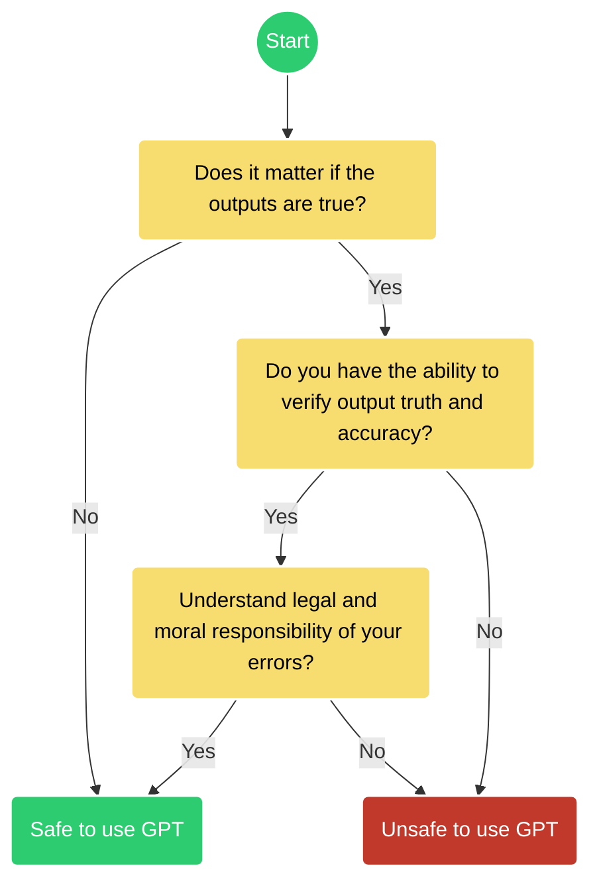

# Ethics of Artificial Intelligence

 This work is licensed under a <a rel="license" href="http://creativecommons.org/licenses/by/4.0/">Creative Commons Attribution 4.0 International License</a>.

!!! Tip "Ethics of AI _or_ Ethical AI"

    [Siau and Wang 2020](https://doi.org/10.4018/JDM.2020040105) delineate **"Ethics of AI"** and **"Ethical AI"** as

    **Ethics of AI:** studies the ethical principals, rules, guidelines, policies, and regulations related to AI.

    while

    **Ethical AI:** is AI that performs or behaves _ethically_. 

## History

In 1956 a small group of scientists gathered at [Dartmouth](https://home.dartmouth.edu/about/artificial-intelligence-ai-coined-dartmouth){target=_blank} for a [Summer Research Project on Artificial Intelligence](https://spectrum.ieee.org/dartmouth-ai-workshop){target=_blank}. A new field of science had begun. 

Over the next 70 years, Artificial Intelligence existed mostly in the minds of science fiction writers and a small group of industry researchers and academics who worked toward creating the digital infrastructure needed for [Artificial General Intelligence (AGI)(:simple-wikipedia:)](https://en.wikipedia.org/wiki/Artificial_general_intelligence){target=_blank}. 

??? Quote "I, Robot :robot:"

    [Author Isaac Asimov](https://en.wikipedia.org/wiki/Isaac_Asimov){target=_blank} wrote a series of popular science fiction novels in the 1950's through the 1980's. His work continues to be adapted into [television series](https://www.rottentomatoes.com/tv/foundation){target=_blank} and [movies](https://www.rottentomatoes.com/m/i_robot){target=_blank}. In his novels, Asimov developed "Three Laws of Robotics" which described how artificial intelligence interacted with humanity in his fictional universe. 

    !!! Quote "The Three Laws"

        **1. A robot may not injure a human being or, through inaction, allow a human being to come to harm.**
        
        **2. A robot must obey the orders given it by human beings except where such orders would conflict with the First Law.**
        
        **3. A robot must protect its own existence as long as such protection does not conflict with the First or Second Law.**

        Asimov later wrote of a 'zeroth' law which superceded the first three laws,

        **0. A robot may not injure humanity or, through inaction, allow humanity to come to harm.**

    <iframe width="560" height="315" src="https://www.youtube.com/embed/qJwHbEugKqg?si=5vHRhTGFNrwBvLlB" title="YouTube video player" frameborder="0" allow="accelerometer; autoplay; clipboard-write; encrypted-media; gyroscope; picture-in-picture; web-share" referrerpolicy="strict-origin-when-cross-origin" allowfullscreen></iframe>

As our conception of intelligence shifts [(Mitchell 2024)](https://doi.org/10.1126/science.adq9356){target=_blank}, mostly in reaction to the release of ChatGPT and its myriad of competitors, new standards of the "Turing Test" have been proposed. 

??? Quote "The Imitation Game :brain:"

    **"Can Machines Think?" -- [Alan Turing, 1950](https://doi.org/10.1093/mind/LIX.236.433){target=_blank}**

    [Alan Turing](https://en.wikipedia.org/wiki/Alan_Turing){target=_blank} the father of all modern computing, proposed a test for intelligence in a computer, requiring that a human being should be unable to distinguish the machine from another human being by using the replies to questions put to both.

    !!! Warning "The Turing Trap"

        The **Turing Trap** is a term coined by Stanford University professor [Erik Brynjolfsson](https://www.brookings.edu/events/the-turing-trap-a-conversation-with-erik-brynjolfsson-on-the-promise-and-peril-of-human-like-ai/){target=_blank} to describe the idea that focusing too much on developing human-like artificial intelligence (HLAI) can be detrimental. 
        
        Brynjolfsson argues that the real potential of AI lies in its ability to augment human abilities, rather than replacing them. He suggests that we should work on challenges that are easy for machines and hard for humans, rather than the other way around. 
        
        **Automation can replace humans**

        HLAI can replace humans in the workplace, which can lead to: 
        
        * **Lower wages** 
        
            As machines become better substitutes for human labor, wages can be driven down.

        * **Loss of economic and political power** 
        
            Workers can lose economic and political bargaining power, and become increasingly dependent on those who control the technology.

        * **Decision-making processes incentivize automation**
        
            Companies may choose to automate tasks to do the same thing faster and cheaper.

        * **Misaligned incentives**

            The risks of the Turing Trap are increased by the misaligned incentives of technologists, businesspeople, and policy-makers. 
        

        ??? Danger ":point_up: this text was created by an :simple-googlegemini: AI!"

            Google began using ["AI Overview"](https://www.google.com/search?q=what+is+the+turing+trap&oq=what+is+the+turing+trap&gs_lcrp){target=_blank} in its popular search engine for subscribing users in 2024. 

In "A Unified Framework of Five Principles for AI in Society" [(Floridi & Cowls 2019)](https://doi.org/10.1162%2F99608f92.8cd550d1){target=_blank} core principles for ethical AI are introduced (Table 1).

#### **Table 1: Floridi & Cowls (2019) Five principles for AI in Society**

| Beneficiance | Non-Maleficence | Autonomy | Justice | Explicability |
|--------------|-----------------|----------|---------|---------------|
| Promoting Well-Being, Preserving Dignity, and Sustaining the Planet | Privacy, Security and ‘Capability Caution’ | The Power to Decide (to Decide) | Promoting Prosperity, Preserving Solidarity, Avoiding Unfairness | Enabling the Other Principles through Intelligibility and Accountability | 

A milestone :octicons-milestone-24: in the [Ethics of Artificial Intelligence (:simple-wikipedia:)](https://en.wikipedia.org/wiki/Ethics_of_artificial_intelligence){target=_blank} occurred in January 2017 in Pacific Grove, California at the historic Asilomar Hotel and Conference Grounds [(Table 2)](#table-2-international-ai-agreements). There the Asilomar AI Principles were signed by leading AI researchers, ethicists, and thought leaders. By 2021, UNESCO had created their own recommendations on AI, focused on human rights and sustainable development.

#### **Table 2: International AI agreements**

| Agreement | Date | Signatories | Description | Source |
|-----------|------|-------------|-------------|--------|
| **Asilomar AI Principles** | January 2017 | AI researchers, ethicists, and thought leaders | A set of 23 principles designed to guide the development of beneficial AI, covering research, ethics, and long-term issues. | [Future of Life Institute](https://futureoflife.org/open-letter/ai-principles/) |
| **Toronto Declaration** | May 16, 2018 | Amnesty International, Access Now, Human Rights Watch, Wikimedia Foundation, and others | A declaration advocating for the protection of the rights to equality and non-discrimination in machine learning systems. | [Toronto Declaration](https://www.torontodeclaration.org/) |
| **OECD AI Principles** | May 22, 2019 | OECD member countries and others | Principles to promote AI that is innovative and trustworthy and that respects human rights and democratic values. | [OECD](https://legalinstruments.oecd.org/en/instruments/OECD-LEGAL-0449) |
| **G20 AI Principles** | June 9, 2019 | G20 member countries | A commitment to human-centered AI, building upon the OECD AI Principles, emphasizing inclusivity, transparency, and accountability. | [G20 Japan 2019](https://www.g20-insights.org/policy_briefs/g20-japan-ai-principles/) |
| **UNESCO Recommendation on the Ethics of Artificial Intelligence** | November 2021 | UNESCO member states | A global framework to ensure that digital transformations promote human rights and contribute to the achievement of the Sustainable Development Goals. | [UNESCO](https://en.unesco.org/artificial-intelligence/ethics) |

In response to the rapid rise of generative AI, specifically GPTs, new agreements on the application of AI for military use, safety, and on its adoption in business and industry were recently signed (Table 3).

 

#### **Table 3: Declarations on AI**

| Agreement | Date | Signatories | Description | Source |
|-----------|------|-------------|-------------|--------|
| **Political Declaration on Responsible Military Use of Artificial Intelligence and Autonomy** | February 16, 2023 | United States and 50 other countries | A declaration outlining principles for the responsible use of AI and autonomy in military applications. | [U.S. Department of State](https://www.state.gov/political-declaration-on-responsible-military-use-of-artificial-intelligence-and-autonomy/) |
| **International Network of AI Safety Institutes** | May 2024 | United Kingdom, United States, Japan, France, Germany, Italy, Singapore, South Korea, Australia, Canada, European Union | A network formed to evaluate and ensure the safety of advanced AI models through international collaboration. | [The Independent](https://www.independent.co.uk/news/uk/politics/rishi-sunak-china-eric-schmidt-bletchley-park-united-states-b2548783.html) |
| **AI Safety Agreement between the UK and US** | June 2024 | United Kingdom, United States | An agreement to collaborate on testing advanced AI models to ensure safety and manage risks. | [BBC News](https://www.bbc.com/news/technology-68675654) |
| **Framework Convention on Artificial Intelligence** | September 5, 2024 | United States, United Kingdom, European Union, Andorra, Georgia, Iceland, Norway, Republic of Moldova, San Marino, Israel | The first legally binding international treaty on AI, aiming to ensure AI activities are consistent with human rights, democracy, and the rule of law. | [Council of Europe](https://www.coe.int/en/web/artificial-intelligence/the-framework-convention-on-artificial-intelligence) |
| **AI Alliance Network** | December 11, 2024 | Russia, BRICS countries (Brazil, China, India, South Africa), Serbia, Indonesia, and others | An initiative to develop AI collaboratively, focusing on joint research, regulation, and commercialization of AI products among member countries. | [Reuters](https://www.reuters.com/technology/artificial-intelligence/russia-teams-up-with-brics-create-ai-alliance-putin-says-2024-12-11/) |

## Using AI ethically

As consumers of GPTs and other AI platforms, we must consider in what ways can we use AI both effectively, and ethically.

**When can you use a GPT for research and education?**

Figure credit: :fontawesome-brands-creative-commons-by: [ChatGPT and Artificial Intelligence in Education, UNESCO 2023 :fontawesome-regular-file-pdf:](https://www.iesalc.unesco.org/wp-content/uploads/2023/04/ChatGPT-and-Artificial-Intelligence-in-higher-education-Quick-Start-guide_EN_FINAL.pdf){target=_blank}

  

## Recent Controversy

[:scales: Master list of current lawsuits against AI companies](https://chatgptiseatingtheworld.com/2024/08/27/master-list-of-lawsuits-v-ai-chatgpt-openai-microsoft-meta-midjourney-other-ai-cos/){target=_blank}

Current AI models are overwhelmingly based on European and North American historical literature and language. Over half of the [content on the internet (:simple-wikipedia:)](https://en.wikipedia.org/wiki/Languages_used_on_the_Internet) is written in English. This creates a [Eurocentric bias](https://www.historica.org/blog/the-impact-of-eurocentric-bias-in-ai-driven-historical-research) in AI training data, resulting in an erasure of global culture, experience, and language. Such [asymmetries need to be addressed](https://www.orfonline.org/expert-speak/global-perspectives-on-ai-bias-addressing-cultural-asymmetries-and-ethical-implications), but there is at present a lack economic incentives for large tech companies and organizations (see [The Imitation Game :brain:](#history) above). 

!!! Danger "The :ox: :poop: Bullshit Machines"

    Professors Carl T. Bergstrom and Jevin D. West teach a course at University of Washington titled "Calling Bullshit", they have written an e-book on GPTs called:

    ["Modern-Day Oracles or Bullshit Machines?"](https://thebullshitmachines.com/table-of-contents/index.html){target=_blanks}

    Their website provides online lesson vignettes and materials for instructors.

Negative consequences of GPTs explosion into the public space are its mis-use as well as its adoption for illegal activity. 

* [A lawyer submits a legal brief written by ChatGPT and is caught](https://www.nytimes.com/2023/05/27/nyregion/avianca-airline-lawsuit-chatgpt.html){target=_blank}

* [Prompt Injection Attacks](https://www.wired.com/story/chatgpt-prompt-injection-attack-security/){target=_blank}

There are [deep ethical concerns about the use of AI](https://www.sciencefriday.com/segments/ai-open-letter-chatgpt-ethics/){target=_blank} like GPT and LLMs, particularly concerning their training data. 

* [A Class Action lawsuit: GitHub CoPilot was trained on private repositories](https://githubcopilotlitigation.com/){target=_blank}

AI companies also effectively steal designs, visual art, and music styles to train their private models. 

* [MidJourney and Dall-E using trademarked imagery and art](https://www.artnews.com/art-in-america/features/midjourney-ai-art-image-generators-lawsuit-1234665579/){target=_blank}

ChatGPT has effectively gamified higher education and is being used to spread disinformation and hate speech. 

* [College students using ChatGPT](https://ethicspolicy.unc.edu/news/2023/04/17/the-ethics-of-college-students-using-chatgpt/){target=_blank}

* [Combating Academic Dishonesty (6-part series)](https://academictech.uchicago.edu/2023/01/23/combating-academic-dishonesty-part-6-chatgpt-ai-and-academic-integrity/){target=_blank}

## Recent Literature

Here are some recent papers that discuss the ethical concerns surrounding AI:

*   **"AI Safety and the Age of Convergences"** (2024) - Schuett, J., Schuett, J., & Korinek, A. [https://doi.org/10.48550/arXiv.2401.06531](https://doi.org/10.48550/arXiv.2401.06531){target=_blank}

    *   Discusses the importance of AI safety in light of multiple technological convergences.

*   **"On the Opportunities and Risks of Foundation Models"** (2023) - Bommasani et al. [https://doi.org/10.48550/arXiv.2108.07258](https://doi.org/10.48550/arXiv.2108.07258){target=_blank}

    *   A comprehensive overview of the capabilities, limitations, and risks of foundation models, including ethical considerations.

*   **"The Ethics of Artificial Intelligence in Education: A Review of the Literature"** (2023) - Zawacki-Richter, O., Marín, V. I., Bond, M., & Gouverneur, F. [https://doi.org/10.1007/s10639-019-09882-z](https://doi.org/10.1007/s10639-019-09882-z){target=_blank}

    *   Reviews the ethical implications of AI in educational contexts, including issues of bias, fairness, and accountability.

*   **"The Ethical Challenges of Algorithmic Bias in Artificial Intelligence: a scoping review"** (2023) - Borenstein, J., Glikson, E., & Krishnamurthy, V. [https://doi.org/10.1007/s43681-023-00313-z](https://doi.org/10.1007/s43681-023-00313-z){target=_blank}

    *   Examines the ethical challenges related to algorithmic bias in AI, focusing on the implications for fairness and justice.

*   **"Ethics of Artificial Intelligence"** (2020) - S. Matthew Liao [https://doi.org/10.1093/oso/9780190905033.001.0001](https://doi.org/10.1093/oso/9780190905033.001.0001){target=_blank}

    *   This is a book that provides a comprehensive overview of the ethical issues related to AI.

## Assessment

??? Question "Can you explain the difference between "Ethics of AI" and "Ethical AI?""

    Hint: Refer to how [Siau and Wang (2020)](#ethics-of-artificial-intelligence) define each term

    ??? Success "Ethics of AI"

        * **Ethics of AI** refers to principles and regulations

    ??? Success "Ethical AI"

        * **Ethical AI** focuses on how AI behaves

??? Question "How does Asimov's Three Laws of Robotics relate to modern ethical concerns of AI?"

    ??? Success "Do no harm"

        Asmiov emphasizes preventing harm to humans and how that concept informs current AI safety practices.

??? Question "True or False: The Turing Trap suggests that efforts to make AI more human-like will empower workers' economic and political power."

    ??? Failure "False"

        The Turing Trap warns against replacing humans with AI, and that AI could be used to drive down wages and to a loss of economic and political power. 

??? Question "Name at least one major declaration or agreement on AI Ethics"

    Hint: See [Table 2](#table-2-international-ai-agreements)

    ??? Success "International Agreements"
             
        * Council of Europe Framework Convention on Artificial Intelligence and human rights

        * Political Declaration on Responsible Military Use of Artificial Intelligence and Autonomy

        * G20 AI Principles
    
    ??? Success "Principles and Ethics"

        * Asilomar AI Principles

        * UNESCO Recommendation on the Ethics of Artificial Intelligence

        * OECD AI Principles

        * Toronto Declaration

??? Question "True or False: It is okay to use a GPT to write a research proposal on a topic you have no experience in?"

    Hint: Review ["Using AI Ethically"](#using-ai-ethically)

    ??? Failure "False"

        If you do not have the ability to verify output truthfully or accurately, it is not safe to use a GPT for research.
