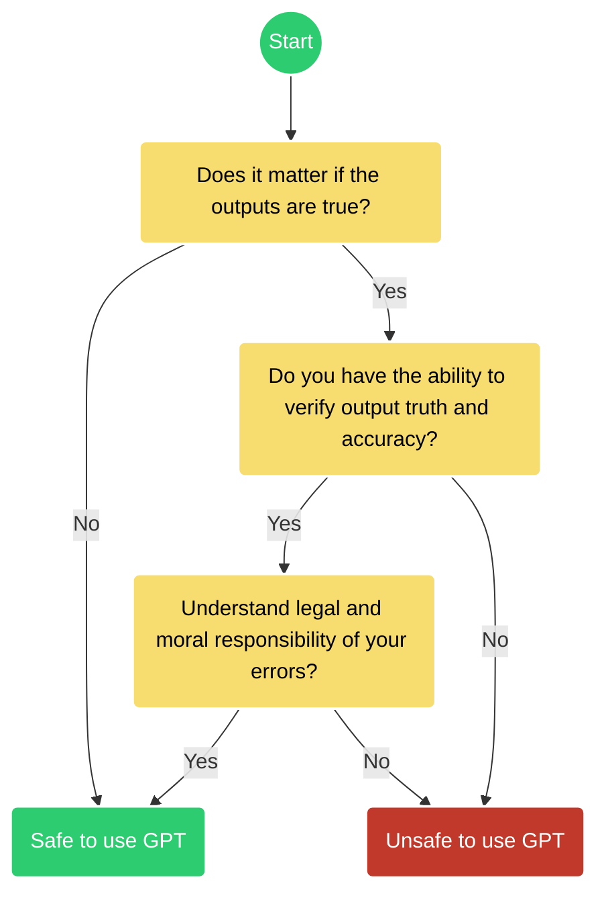

# Ethics of using AI

 This work is licensed under a <a rel="license" href="http://creativecommons.org/licenses/by/4.0/">Creative Commons Attribution 4.0 International License</a>.

 **When can you use a GPT for research and education?**

Figure credit, based on: :fontawesome-brands-creative-commons-by: [ChatGPT and Artificial Intelligence in Education, UNESCO 2023 :fontawesome-regular-file-pdf:](https://www.iesalc.unesco.org/wp-content/uploads/2023/04/ChatGPT-and-Artificial-Intelligence-in-higher-education-Quick-Start-guide_EN_FINAL.pdf){target=_blank}

  
## Controversy

 The last two years has seen a rash of cases around the mis-use and illegal applications of GPTs and LLMs.

There are [deep ethical concerns about the use of AI](https://www.sciencefriday.com/segments/ai-open-letter-chatgpt-ethics/){target=_blank} like GPT and LLMs, particularly concerning their training data.

ChatGPT has effectively gamified higher education, is biased, can lie, and is being used to spread disinformation and hate speech. It also effectively steals designs, visual art, and music styles. 

[European Union's proposed AI Act legislation](https://www.cnbc.com/2023/05/15/eu-ai-act-europe-takes-aim-at-chatgpt-with-landmark-regulation.html){target=_blank}

[Class Action: GitHub CoPilot trained on private repositories](https://githubcopilotlitigation.com/){target=_blank}

[MidJourney and Dall-E using trademarked imagery and art](https://www.artnews.com/art-in-america/features/midjourney-ai-art-image-generators-lawsuit-1234665579/){target=_blank}

[A lawyer submits a legal brief written by ChatGPT and is caught](https://www.nytimes.com/2023/05/27/nyregion/avianca-airline-lawsuit-chatgpt.html){target=_blank}

[College students using ChatGPT](https://ethicspolicy.unc.edu/news/2023/04/17/the-ethics-of-college-students-using-chatgpt/){target=_blank}

[Prompt Injection Attacks](https://www.wired.com/story/chatgpt-prompt-injection-attack-security/){target=_blank}

## Recent Papers on the Ethics of AI

Here are some recent papers that discuss the ethical concerns surrounding AI:

*   **"Ethical and social risks of harm from Language Models"** (2023) - Weidinger et al. [https://doi.org/10.48550/arXiv.2212.08342](https://doi.org/10.48550/arXiv.2212.08342)

    *   This paper provides a taxonomy of ethical and social risks associated with language models.

*   **"AI Safety and the Age of Convergences"** (2024) - Schuett, J., Schuett, J., & Korinek, A. [https://doi.org/10.48550/arXiv.2401.06531](https://doi.org/10.48550/arXiv.2401.06531)

    *   Discusses the importance of AI safety in light of multiple technological convergences.

*   **"On the Opportunities and Risks of Foundation Models"** (2023) - Bommasani et al. [https://doi.org/10.48550/arXiv.2108.07258](https://doi.org/10.48550/arXiv.2108.07258)

    *   A comprehensive overview of the capabilities, limitations, and risks of foundation models, including ethical considerations.

*   **"The Ethics of Artificial Intelligence in Education: A Review of the Literature"** (2023) - Zawacki-Richter, O., Marín, V. I., Bond, M., & Gouverneur, F. [https://doi.org/10.1007/s10639-019-09882-z](https://doi.org/10.1007/s10639-019-09882-z)

    *   Reviews the ethical implications of AI in educational contexts, including issues of bias, fairness, and accountability.

*   **"The Ethical Challenges of Algorithmic Bias in Artificial Intelligence: a scoping review"** (2023) - Borenstein, J., Glikson, E., & Krishnamurthy, V. [https://doi.org/10.1007/s43681-023-00313-z](https://doi.org/10.1007/s43681-023-00313-z)

    *   Examines the ethical challenges related to algorithmic bias in AI, focusing on the implications for fairness and justice.

*   **"Ethics of Artificial Intelligence"** (2020) - S. Matthew Liao [https://doi.org/10.1093/oso/9780190905033.001.0001](https://doi.org/10.1093/oso/9780190905033.001.0001)

    *   This is a book that provides a comprehensive overview of the ethical issues related to AI.

!!! Tip "Ethics of Artificial Intelligence"

    * [The Asilomar AI Principles (2017)](https://futureoflife.org/open-letter/ai-principles/){target=_blank}
    
    * [A Unified Framework of Five Principles for AI in Society](https://doi.org/10.1162%2F99608f92.8cd550d1){target=_blank}
    
    * [Ethics of Artificial Intelligence (:simple-wikipedia:)](https://en.wikipedia.org/wiki/Ethics_of_artificial_intelligence){target=_blank}