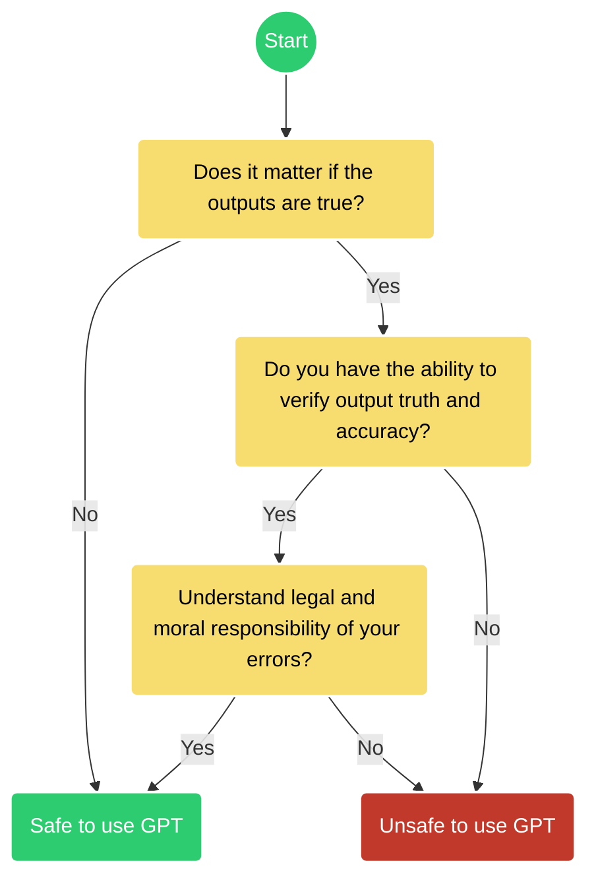

# Ethical & Legal Considerations

 This work is licensed under a <a rel="license" href="http://creativecommons.org/licenses/by/4.0/">Creative Commons Attribution 4.0 International License</a>.

## Foundations of the Ethical principles for AI

This lesson focuses on the ethical principles that ground AI in a legal landscape.

### Science Fiction or a Philosophical Theory?

In the early 1950's [Alan Turing](https://en.wikipedia.org/wiki/Alan_Turing){target=_blank} the father of all modern computing, proposed a test for intelligence in a computer, requiring that a human being should be unable to distinguish the machine from another human being by using the replies to questions put to both.

!!! Quote "The Imitation Game :brain:"
    
    **"Can Machines Think?" -- [Alan Turing, 1950](https://doi.org/10.1093/mind/LIX.236.433){target=_blank}**

    ??? Question "Today's Turing Tests"

        <iframe width="560" height="315" src="https://www.youtube.com/embed/_2NijXqBESI?si=EAF4rMEKbLj4mtPi" title="YouTube video player" frameborder="0" allow="accelerometer; autoplay; clipboard-write; encrypted-media; gyroscope; picture-in-picture; web-share" referrerpolicy="strict-origin-when-cross-origin" allowfullscreen></iframe> 

        <iframe width="560" height="315" src="https://www.youtube.com/embed/-IUUCTiIIkc?si=frNBEBmL4FSUItdu" title="YouTube video player" frameborder="0" allow="accelerometer; autoplay; clipboard-write; encrypted-media; gyroscope; picture-in-picture; web-share" referrerpolicy="strict-origin-when-cross-origin" allowfullscreen></iframe>  
    

[Author Isaac Asimov](https://en.wikipedia.org/wiki/Isaac_Asimov){target=_blank} wrote a series of popular science fiction novels in the 1950's through the 1980's. His work continues to be adapted into [television series](https://www.rottentomatoes.com/tv/foundation){target=_blank} and [movies](https://www.rottentomatoes.com/m/i_robot){target=_blank}. In his novels, Asimov developed **Three Laws of Robotics** which described how artificial intelligence interacted with humanity in his fictional universe. 

??? Quote ":robot: The Three Laws"  

    **1. A robot may not injure a human being or, through inaction, allow a human being to come to harm.**
      
    **2. A robot must obey the orders given it by human beings except where such orders would conflict with the First Law.**
        
    **3. A robot must protect its own existence as long as such protection does not conflict with the First or Second Law.**

    Asimov later wrote of a 'zeroth' law which superceded the first three laws,

    **0. A robot may not injure humanity or, through inaction, allow humanity to come to harm.**

    <iframe width="560" height="315" src="https://www.youtube.com/embed/qJwHbEugKqg?si=5vHRhTGFNrwBvLlB" title="YouTube video player" frameborder="0" allow="accelerometer; autoplay; clipboard-write; encrypted-media; gyroscope; picture-in-picture; web-share" referrerpolicy="strict-origin-when-cross-origin" allowfullscreen></iframe>

Asimov's Three Laws are difficult to interpret in a real-world setting and he himself spent most of his novels describing creative and unexpected ways in which the Three Laws were twisted yet not broken. The basis of the Three Laws as a legal framework is untenable, but does represent a moral and ethical starting point from which we can think about AI and the legal rights of non-biological beings.  

Another science-fiction author Sir Arthur C. Clarke, in 1978 provided an interesting perspective on how humanity would have to come to terms with AI once its capabilities surpass our own:

<iframe width="560" height="315" src="https://www.youtube.com/embed/I9DFNoNn65o?si=ENza4gUvjO3eaTXv" title="YouTube video player" frameborder="0" allow="accelerometer; autoplay; clipboard-write; encrypted-media; gyroscope; picture-in-picture; web-share" referrerpolicy="strict-origin-when-cross-origin" allowfullscreen></iframe>

Recently, researchers published findings showing that [current GPTs are now capable of passing Turing tests](https://doi.org/10.48550/arXiv.2503.23674){target=_blank}. As our conception of intelligence shifts [(Mitchell 2024)](https://doi.org/10.1126/science.adq9356){target=_blank}, mostly in reaction to the release of ChatGPT and its myriad of competitors, new standards of the **Turing Test** are being proposed. 

Importantly, current AI exposes the limits of Turing Tests based on [imitation without comprehension](https://medium.com/@michellevarron/the-turing-test-is-obsolete-its-time-for-a-new-standard-c243513c5076){target=_blank}. 

The **Turing Trap** is a term coined by Stanford University professor [Erik Brynjolfsson](https://www.brookings.edu/events/the-turing-trap-a-conversation-with-erik-brynjolfsson-on-the-promise-and-peril-of-human-like-ai/){target=_blank} to describe the idea that focusing too much on developing human-like artificial intelligence (HLAI) can be detrimental. 
    
Brynjolfsson argues that the real potential of AI lies in its ability to augment human abilities, rather than replacing them. He suggests that we should work on challenges that are easy for machines and hard for humans, rather than the other way around. 
    
!!! Warning "Beware the Turing Trap"
    
    **Automation can replace humans**
    
    HLAI can replace humans in the workplace, which can lead to: 
    
    * **Lower wages** 
    
        As machines become better substitutes for human labor, wages can be driven down.
    
    * **Loss of economic and political power** 
    
        Workers can lose economic and political bargaining power, and become increasingly dependent on those who control the technology.
    
    * **Decision-making processes incentivize automation**
    
        Companies may choose to automate tasks to do the same thing faster and cheaper.
 
    * **Misaligned incentives**
     
        The risks of the Turing Trap are increased by the misaligned incentives of technologists, businesspeople, and policy-makers. 
    
    ??? Danger ":point_up: this text was written by :simple-googlegemini: AI and then reviewed by a human. Do you still trust it?"

        [Researchers have found](https://doi.org/10.1016/j.obhdp.2025.104405){target=_blank} disclosing the use of AI makes people [trust you less](https://theconversation.com/being-honest-about-using-ai-at-work-makes-people-trust-you-less-research-finds-253590){target=_blank}.

 
## Ethical AI

In "A Unified Framework of Five Principles for AI in Society" [(Floridi & Cowls 2019)](https://doi.org/10.1162%2F99608f92.8cd550d1){target=_blank} core principles for ethical AI are introduced (Table 1).
    
#### **Table 1: Floridi & Cowls (2019) Five principles for AI in Society**
    
| Beneficiance | Non-Maleficence | Autonomy | Justice | Explicability |
|--------------|-----------------|----------|---------|---------------|
| Promoting Well-Being, Preserving Dignity, and Sustaining the Planet | Privacy, Security and ‘Capability Caution’ | The Power to Decide (to Decide) | Promoting Prosperity, Preserving Solidarity, Avoiding Unfairness | Enabling the Other Principles through Intelligibility and Accountability |  Core Values & Guiding Principles

## International Agreements on AI

A milestone :octicons-milestone-24: in the [Ethics of Artificial Intelligence (:simple-wikipedia:)](https://en.wikipedia.org/wiki/Ethics_of_artificial_intelligence){target=_blank} occurred in January 2017 in Pacific Grove, California at the historic Asilomar Hotel and Conference Grounds [(Table 2)](#table-2-international-ai-agreements). There the Asilomar AI Principles were signed by leading AI researchers, ethicists, and thought leaders. 
    
By 2021, UNESCO had created their own recommendations on AI, focused on human rights and sustainable development.
    
#### **Table 2: International AI agreements**

| Agreement | Date | Signatories | Description | 
|-----------|------|-------------|-------------|
| [**Asilomar AI Principles**](https://futureoflife.org/open-letter/ai-principles/){target=_blank} | January 2017 | AI researchers, ethicists, and thought leaders | A set of 23 principles designed to guide the development of beneficial AI, covering research, ethics, and long-term issues. | 
| [**Toronto Declaration**](https://www.torontodeclaration.org/){target=_blank}| May 16, 2018 | Amnesty International, Access Now, Human Rights Watch, Wikimedia Foundation, and others | A declaration advocating for the protection of the rights to equality and non-discrimination in machine learning systems. | 
| [**OECD AI Principles**](https://legalinstruments.oecd.org/en/instruments/OECD-LEGAL-0449){target=_blank} | May 22, 2019 | OECD member countries and others | Principles to promote AI that is innovative and trustworthy and that respects human rights and democratic values. | 
| [**G20 AI Principles**](https://www.g20-insights.org/policy_briefs/g20-japan-ai-principles/){target=_blank}  | June 9, 2019 | G20 member countries | A commitment to human-centered AI, building upon the OECD AI Principles, emphasizing inclusivity, transparency, and accountability. | 
| [**WHO Ethics and governance of artificial intelligence for health**](https://www.who.int/publications/i/item/9789240029200){target=_blank} | June 2021 | WHO Ministries of Health members | A guidance on  eighteen months of deliberation amongst experts from Ministries of Health | 
| [**UNESCO Recommendation on the Ethics of Artificial Intelligence**](https://en.unesco.org/artificial-intelligence/ethics){target=_blank} | November 2021 | UNESCO member states | A global framework to ensure that digital transformations promote human rights and contribute to the achievement of the Sustainable Development Goals. | 
| [**European Union Artificial Intelligence Act**](https://artificialintelligenceact.eu/){target=_blank} | July 2024 | EU member countries | Classifies risk, obligations, legal, and general purpose AI laws | 
| [**UN Resolution A/RES/79/325**](https://docs.un.org/en/A/RES/79/325){target=_blank} | August 2025 | United Nations Resolution | Created the Scientific Panel on AI (like the IPCC for AI) |

In response to the rapid rise of generative AI, specifically GPTs, new agreements on the application of AI for military use, safety, and on its adoption in business and industry were recently signed (Table 3).

#### **Table 3: Declarations on AI**

| Agreement | Date | Signatories | Description | Source |
|-----------|------|-------------|-------------|--------|
| **Political Declaration on Responsible Military Use of Artificial Intelligence and Autonomy** | February 16, 2023 | United States and 50 other countries | A declaration outlining principles for the responsible use of AI and autonomy in military applications. | [U.S. Department of State](https://www.state.gov/political-declaration-on-responsible-military-use-of-artificial-intelligence-and-autonomy/){target=_blank} |
| **International Network of AI Safety Institutes** | May 2024 | United Kingdom, United States, Japan, France, Germany, Italy, Singapore, South Korea, Australia, Canada, European Union | A network formed to evaluate and ensure the safety of advanced AI models through international collaboration. | [The Independent](https://www.independent.co.uk/news/uk/politics/rishi-sunak-china-eric-schmidt-bletchley-park-united-states-b2548783.html){target=_blank} |
| **AI Safety Agreement between the UK and US** | June 2024 | United Kingdom, United States | An agreement to collaborate on testing advanced AI models to ensure safety and manage risks. | [BBC News](https://www.bbc.com/news/technology-68675654){target=_blank} |
| **Framework Convention on Artificial Intelligence** | September 5, 2024 | United States, United Kingdom, European Union, Andorra, Georgia, Iceland, Norway, Republic of Moldova, San Marino, Israel | The first legally binding international treaty on AI, aiming to ensure AI activities are consistent with human rights, democracy, and the rule of law. | [Council of Europe](https://www.coe.int/en/web/artificial-intelligence/the-framework-convention-on-artificial-intelligence){target=_blank} |
| **AI Alliance Network** | December 11, 2024 | Russia, BRICS countries (Brazil, China, India, South Africa), Serbia, Indonesia, and others | An initiative to develop AI collaboratively, focusing on joint research, regulation, and commercialization of AI products among member countries. | [Reuters](https://www.reuters.com/technology/artificial-intelligence/russia-teams-up-with-brics-create-ai-alliance-putin-says-2024-12-11/){target=_blank} |

## Current Legislation

[National Conference of State Legislatures (NCSL) Artificial Intelligence 2025 Legislation](https://www.ncsl.org/technology-and-communication/artificial-intelligence-2025-legislation){target=_blank}

The previous administration had proposed a ["Blueprint for an AI Bill of Rights"](https://bidenwhitehouse.archives.gov/ostp/ai-bill-of-rights/){target=_blank}, and executive order around the ["Safe, Secure, and Trustworthy Development and Use of Artificial Intelligence"](https://www.federalregister.gov/documents/2023/11/01/2023-24283/safe-secure-and-trustworthy-development-and-use-of-artificial-intelligence){target=_blank} which is now rescinded. 

The current administration has instead focused most of its efforts on executive orders related to AI and federal agencies. [Pending legislation](https://www.newsweek.com/trump-constitutional-crisis-ai-2076230){target=_blank} would ban states' ability to enforce AI regulations. 

!!! Tip "2025 Executive Orders"

    * [REMOVING BARRIERS TO AMERICAN LEADERSHIP IN ARTIFICIAL INTELLIGENCE, January 23, 2025](https://www.whitehouse.gov/presidential-actions/2025/01/removing-barriers-to-american-leadership-in-artificial-intelligence/){target=_blank}

    * [OMB Accelerating Federal Use of AI through Innovation, Governance, and Public Trust, April 3, 2025](https://www.whitehouse.gov/wp-content/uploads/2025/02/M-25-21-Accelerating-Federal-Use-of-AI-through-Innovation-Governance-and-Public-Trust.pdf){target=_blank}

        * [Fact Sheet: Eliminating Barriers for Federal Artificial Intelligence Use and Procurement, April 7, 2025](https://www.whitehouse.gov/fact-sheets/2025/04/fact-sheet-eliminating-barriers-for-federal-artificial-intelligence-use-and-procurement/){target=_blank}

    * [ADVANCING ARTIFICIAL INTELLIGENCE EDUCATION FOR AMERICAN YOUTH, April 23, 2025](https://www.whitehouse.gov/presidential-actions/2025/04/advancing-artificial-intelligence-education-for-american-youth/){target=_blank}

    * [Restoring Gold Standard Science, May 23, 2025](https://www.whitehouse.gov/presidential-actions/2025/05/restoring-gold-standard-science/){target=_blank}

        * [Fact Sheet: President Donald J. Trump is Restoring Gold Standard Science in America](https://www.whitehouse.gov/fact-sheets/2025/05/fact-sheet-president-donald-j-trump-deploys-advanced-nuclear-reactor-technologies-for-national-security/){target=_blank}

As of today, there are no comprehensive federal laws or regulations that have been enacted to specifically regulate AI in the United States of America.  

## AI Ethics

??? Question "What are we talking about, the Ethics of AI, or Ethical AI? How are they different?"

    !!! Answer "They are not the same thing"
    
        [Siau and Wang 2020](https://doi.org/10.4018/JDM.2020040105){target=_blank} delineate **"Ethics of AI"** and **"Ethical AI"** as

        **Ethics of AI:** studies the ethical principals, rules, guidelines, policies, and regulations related to AI.

        **Ethical AI:** is AI that performs or behaves _ethically_. 

As consumers of GPTs and other AI platforms, we must consider in what ways can we use AI both effectively, and ethically.

**When can you use a GPT for research and education?**

Figure credit: :fontawesome-brands-creative-commons-by: [ChatGPT and Artificial Intelligence in Education, UNESCO 2023 :fontawesome-regular-file-pdf:](https://www.iesalc.unesco.org/wp-content/uploads/2023/04/ChatGPT-and-Artificial-Intelligence-in-higher-education-Quick-Start-guide_EN_FINAL.pdf){target=_blank}

  
    
## Recent Controversy

### Maps of AI Copyright Lawsuits

[:scales: Master list of current lawsuits against AI companies](https://chatgptiseatingtheworld.com/2024/08/27/master-list-of-lawsuits-v-ai-chatgpt-openai-microsoft-meta-midjourney-other-ai-cos/){target=_blank}

Current AI models are overwhelmingly based on European and North American historical literature and language. Over half of the [content on the internet (:simple-wikipedia:)](https://en.wikipedia.org/wiki/Languages_used_on_the_Internet) is written in English. This creates a [Eurocentric bias](https://www.historica.org/blog/the-impact-of-eurocentric-bias-in-ai-driven-historical-research) in AI training data, resulting in an erasure of global culture, experience, and language. Such [asymmetries need to be addressed](https://www.orfonline.org/expert-speak/global-perspectives-on-ai-bias-addressing-cultural-asymmetries-and-ethical-implications), but there is at present a lack economic incentives for large tech companies and organizations (see [The Imitation Game :brain:](#foundations-of-the-ethical-principles-for-ai) above). 

!!! Danger "The :ox: :poop: Bullshit Machines"
    
    Professors Carl T. Bergstrom and Jevin D. West teach a course at University of Washington titled "Calling Bullshit", they have written an e-book on GPTs called:

    ["Modern-Day Oracles or Bullshit Machines?"](https://thebullshitmachines.com/table-of-contents/index.html){target=_blanks}

    Their website provides online lesson vignettes and materials for instructors.
    
Negative consequences of GPTs explosion into the public space are its mis-use as well as its adoption for illegal activity. 
    
* [A lawyer submits a legal brief written by ChatGPT and is caught](https://www.nytimes.com/2023/05/27/nyregion/avianca-airline-lawsuit-chatgpt.html){target=_blank}

* [Prompt Injection Attacks](https://www.wired.com/story/chatgpt-prompt-injection-attack-security/){target=_blank}

There are [deep ethical concerns about the use of AI](https://www.sciencefriday.com/segments/ai-open-letter-chatgpt-ethics/){target=_blank} like GPT and LLMs, particularly concerning their training data. 

* [A Class Action lawsuit: GitHub CoPilot was trained on private repositories](https://githubcopilotlitigation.com/){target=_blank}

AI companies also effectively steal designs, visual art, and music styles to train their private models. 

* [MidJourney and Dall-E using trademarked imagery and art](https://www.artnews.com/art-in-america/features/midjourney-ai-art-image-generators-lawsuit-1234665579/){target=_blank}

ChatGPT has effectively gamified higher education and is being used to spread disinformation and hate speech. 

* [College students using ChatGPT](https://ethicspolicy.unc.edu/news/2023/04/17/the-ethics-of-college-students-using-chatgpt/){target=_blank}

* [Combating Academic Dishonesty (6-part series)](https://academictech.uchicago.edu/2023/01/23/combating-academic-dishonesty-part-6-chatgpt-ai-and-academic-integrity/){target=_blank}

## Recent Literature

Here are some recent papers that discuss the ethical concerns surrounding AI:

*   **"AI Safety and the Age of Convergences"** (2024) - Schuett, J., Schuett, J., & Korinek, A. [https://doi.org/10.48550/arXiv.2401.06531](https://doi.org/10.48550/arXiv.2401.06531){target=_blank}

*   **"On the Opportunities and Risks of Foundation Models"** (2023) - Bommasani et al. [https://doi.org/10.48550/arXiv.2108.07258](https://doi.org/10.48550/arXiv.2108.07258){target=_blank}

* **Unraveling the Ethical Conundrum of Artificial Intelligence: A Synthesis of Literature and Case Studies** Poli, P.K.R., Pamidi, S. & Poli, S.K.R. Augment Hum Res 10, 2 (2025). [https://doi.org/10.1007/s41133-024-00077-5](https://doi.org/10.1007/s41133-024-00077-5){target=_blank}

*   **"The Ethics of Artificial Intelligence in Education: A Review of the Literature"** (2023) - Zawacki-Richter, O., Marín, V. I., Bond, M., & Gouverneur, F. [https://doi.org/10.1007/s10639-019-09882-z](https://doi.org/10.1007/s10639-019-09882-z){target=_blank}

*   **"The Ethical Challenges of Algorithmic Bias in Artificial Intelligence: a scoping review"** (2023) - Borenstein, J., Glikson, E., & Krishnamurthy, V. [https://doi.org/10.1007/s43681-023-00313-z](https://doi.org/10.1007/s43681-023-00313-z){target=_blank}

*   **"Ethics of Artificial Intelligence"** (2020) - S. Matthew Liao [https://doi.org/10.1093/oso/9780190905033.001.0001](https://doi.org/10.1093/oso/9780190905033.001.0001){target=_blank}

* **The Ethics of AI Ethics: An Evaluation of Guidelines.** (2020) Hagendorff, T.  Minds & Machines 30, 99–120. [https://doi.org/10.1007/s11023-020-09517-8](https://doi.org/10.1007/s11023-020-09517-8){target=_blank}

## Assessment

??? Question "True or False: The "Turing Trap" primarily warns against the socio-economic disruptions and misaligned incentives that arise from an overemphasis on creating AI that imitates human intelligence."

    ??? Success "True"

        The [**Turing Trap**](#foundations-of-the-ethical-principles-for-ai) by Stanford University professor Erik Brynjolfsson describes the idea that focusing too much on developing human-like artificial intelligence (HLAI) is detrimental. 
        
        Brynjolfsson further elaborates risks like lower wages, loss of economic power, and misaligned incentives due to automation replacing humans.

??? Question "True or False: The concepts of "Ethics of AI" and "Ethical AI" are fundamentally distinct."

    ??? Success "True"

        Siau and Wang (2020): "**Ethics of AI:** studies the ethical principals, rules, guidelines, policies, and regulations related to AI." and "**Ethical AI:** is AI that performs or behaves _ethically_." 

??? Question "Multiple Choice: According to Floridi & Cowls' (2019) "Unified Framework of Five Principles for AI in Society," which principle most directly underscores the importance of AI systems being designed to be understandable, traceable, and accountable for their operations and decisions?"

    *   A) Beneficence 
    *   B) Non-Maleficence 
    *   C) Justice 
    *   D) Explicability 

    ??? answer 
        
        **D) Explicability**
        
        [Table 1](#table-1-floridi--cowls-2019-five-principles-for-ai-in-society) from Floridi & Cowls (2019) describes **Explicability** as "Enabling the Other Principles through Intelligibility and Accountability." This directly relates to AI systems being understandable, traceable, and accountable.

??? Question "Multiple Choice: The Asilomar AI Principles, established in 2017, are best characterized as:"

    *   A) A legally binding international treaty mandating specific safety protocols for all AI development.
    *   B) A technical specification for building universally safe Artificial General Intelligence.
    *   C) A foundational set of guiding principles addressing research ethics, societal values, and long-term considerations for developing beneficial AI.
    *   D) A corporate social responsibility charter adopted exclusively by major technology companies.

    ??? answer 
        
        **C) A foundational set of guiding principles addressing research ethics, societal values, and long-term considerations for developing beneficial AI.**
        
        [Table 2](#table-2-international-ai-agreements) describes the **Asilomar AI Principles** as "A set of 23 principles designed to guide the development of beneficial AI, covering research, ethics, and long-term issues." This aligns with option C and not with the descriptions of a legally binding treaty, a technical specification, or an exclusive corporate charter.

??? Question "What recent international agreement is the "first legally binding international treaty on AI," specifically designed to ensure that AI activities are developed and applied in a manner consistent with human rights, democracy, and the rule of law. What is the name of this treaty?"

    ??? Success 
    
        **Framework Convention on Artificial Intelligence**
        
        [Table 3](#table-3-declarations-on-ai) lists the **Framework Convention on Artificial Intelligence** (September 5, 2024) with the description: "The first legally binding international treaty on AI, aiming to ensure AI activities are consistent with human rights, democracy, and the rule of law."

??? Question "True or False: The United States has the strongest regulations and most comprehensive federal laws specifically enacted to regulate AI."

    ??? Failure "False"

        The US has no laws around the regulation of AI to-date. [Current legislation](#current-legislation) around AI is happening at a state level, but that may be stopped by federal legislation banning regulation. Currently, the administration favors Executive Orders.
        
        On the other side of the pond, the EU has proposed and is developing regulations through the [European Union Artificial Intelligence Act (2024-2031)](https://artificialintelligenceact.eu/){target=_blank}.
