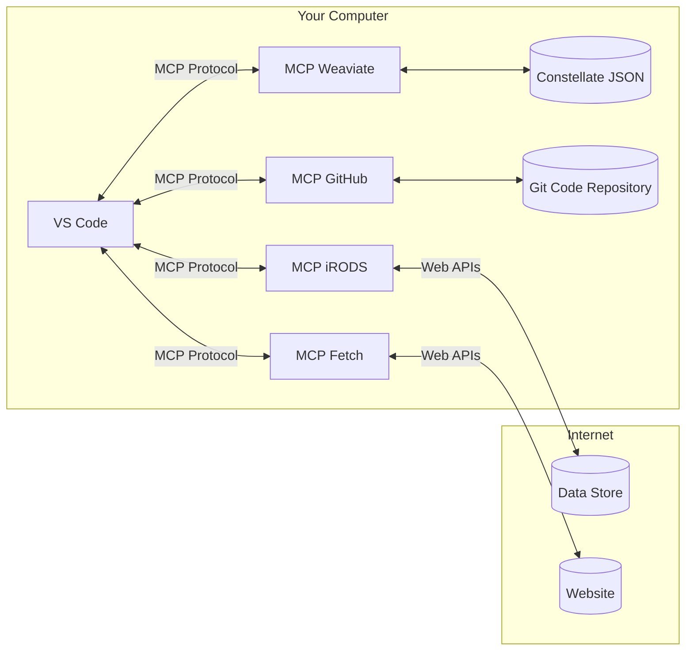

# Model Context Protocol (MCP) 

## What is Model Context Protocol (MCP)? 

[**Model Context Protocol (MCP)**](https://modelcontextprotocol.io/introduction){target=_blank} is a standardized communication framework designed to allow Large Language Models (LLMs) and other AI tools to access and understand the **context** of what a user is currently working on within various applications.

Think of it as a universal translator and information bridge. It enables your AI assistant to "see" and "interact with" the content and state of your active applications—be it your code editor, a 3D modeling suite, a design tool, or a document processor.

**Core Purpose of MCP:**

* **Deepen AI Understanding:** By providing LLMs with rich, real-time context from applications, MCP allows them to offer far more accurate, relevant, and integrated assistance. Instead of generic advice, the AI can give specific, actionable suggestions based on your current work.
* **Enable Interoperability:** MCP aims to create a common ground for different software tools and AI models to share contextual information seamlessly. This breaks down the traditional silos between applications, allowing for more fluid workflows.
* **Facilitate Dynamic Interaction:** MCP is not just about reading context; it can also be about *acting* on it. This opens the door for AI to suggest modifications, automate tasks, or even co-create content directly within the host application. This is a key component of what some call "Vibe Coding" or "Contextual AI Assistance," where the AI has a deep, almost intuitive understanding of the project's flow and the user's intent.

**Why is MCP Important?**

As AI becomes increasingly integrated into professional and creative workflows, the need for it to understand the *specifics* of our work is paramount. Generic LLMs are powerful, but MCP unlocks a new level of utility by making them context-aware and application-aware.

---

## How MCP Works: The Core Components 

MCP typically operates on a client-server model and defines the rules for how contextual information is exchanged.

* **MCP Servers (Providers):**
    * These are often implemented as **extensions, plugins, or add-ons** within host applications (e.g., a VS Code Server Extension, a Blender Add-on).
    * Their primary role is to **expose** relevant contextual information from the application. This might include:
        * The content of the currently open file(s).
        * User selections (text, objects, layers).
        * Project structure or scene graphs.
        * Application state (e.g., current tool, mode, error messages).
        * Undo/redo history (in more advanced scenarios).
    * MCP Servers listen for requests from MCP Clients and respond with structured **context snippets**.
    * They may also expose capabilities for the client to invoke actions within the application.

* **MCP Clients (Consumers):**
    * These are typically LLMs, AI assistants (like a conceptual Claude Desktop with MCP capabilities), or other tools that need to consume context.
    * They **request** context from MCP Servers to better understand the user's environment and intent.
    * This context is then used by the LLM to:
        * Generate more relevant and accurate responses.
        * Offer context-specific suggestions.
        * Formulate requests for actions to be performed in the host application.

* **The Protocol Specification:**
    * This is the heart of MCP. It defines the **rules of engagement**:
        * **Message Formats:** How data is structured (commonly JSON or similar).
        * **Transport Mechanisms:** How messages are sent (e.g., WebSockets, HTTP, gRPC, or other Inter-Process Communication (IPC) methods).
        * **Discovery:** How clients find and connect to available MCP servers.
        * **Context Types:** Standardized ways to describe different kinds of context (e.g., `text_document_v1`, `selection_v1`, `blender_scene_graph_v1`). This ensures both client and server understand the data being exchanged.
        * **Request/Response Patterns:** Defines how clients ask for context (or actions) and how servers provide it (or confirm actions).
        * **Capabilities Negotiation:** A way for client and server to understand what context types and actions each supports.

**Simplified Communication Flow:**

1.  **Discovery & Connection:** The MCP Client (e.g., Claude Desktop) discovers and establishes a connection with an MCP Server running in a target application (e.g., Blender). This might happen automatically on application launch or upon user command.
2.  **User Interaction / AI Trigger:** The user asks the AI a question or performs an action that triggers the AI to seek more context.
3.  **Context Request:** The MCP Client sends a request to the MCP Server for specific types of context relevant to the user's query or the AI's needs.
4.  **Context Provision:** The MCP Server gathers the requested information from the host application and sends it back to the Client as one or more context snippets.
5.  **LLM Processing:** The Client (or the LLM it interfaces with) processes the user's original prompt enriched with the received context.
6.  **Informed Response / Action Invocation:**
    * The LLM generates a more informed and relevant response to the user.
    * Alternatively, the LLM might decide an action is needed within the host application. It would then instruct the MCP Client to send an "action request" to the MCP Server.
7.  **Action Execution & Feedback (if applicable):** The MCP Server receives the action request, validates it, and attempts to perform the action using the host application's APIs. It then sends a response back to the client indicating success or failure.

---

## Benefits of Using MCP 

* **Hyper-Relevant AI Assistance:** LLMs can provide advice, code, or content that is directly applicable to the task at hand.
* **Seamless Workflow Integration:** AI becomes a "native" part of the application experience, rather than a separate tool requiring constant copy-pasting.
* **Reduced Cognitive Load & Task Switching:** Users get help where they are, minimizing disruption.
* **Powerful Automation Capabilities:** Enables AI to perform routine or complex tasks within applications on the user's behalf.
* **Enhanced "Vibe Coding":** The AI can better anticipate needs and understand the nuances of a project by having access to its evolving state.
* **Cross-Application Coordination (Future Potential):** Imagine an AI orchestrating tasks across multiple MCP-enabled applications.

---

## Key Takeaways 🚀

* **MCP is a Context Bridge:** It connects LLMs to the live working environments of applications.
* **Client-Server Model:** Applications (via Servers/Add-ons) provide context and action capabilities; AI tools (Clients) consume and utilize them.
* **Standardization is Crucial:** A well-defined protocol (message formats, context types, action IDs) is essential for interoperability.
* **Beyond Information Retrieval:** MCP enables AI to become an active participant by invoking actions within tools.
* **The Future is Integrated:** MCP and similar protocols are foundational for building truly integrated AI co-pilots and assistants that enhance "Vibe Coding" and other context-rich workflows.
* **Still Evolving:** While the concepts are powerful, widespread adoption, robust implementations, and universally accepted standards for MCP are areas of active development in the AI and software industries.

---

## Further Exploration & Discussion Points 📚

* **Security Implications:** How do we ensure that MCP connections are secure and that AI actions are sandboxed or require user confirmation for sensitive operations?
* **Granularity of Context:** What is the "right" amount of context? Too little is unhelpful; too much can be overwhelming or slow.
* **Discoverability:** How can users and AI clients easily discover which applications support MCP and what capabilities they offer?
* **User Experience:** How should AI interactions mediated by MCP be presented to the user to be intuitive and non-intrusive?
* **Real-world Implementations:** Research existing VS Code extensions or other tool integrations that use similar context-sharing mechanisms (even if not formally labeled "MCP"). What can we learn from them?
* **Your Tools:** Think about the applications you use daily. How could MCP enhance your workflow with them if an AI could understand and interact with their context?

This workshop provides a foundational understanding of Model Context Protocol. As AI continues to weave itself into the fabric of our digital tools, protocols like MCP will be instrumental in shaping a more intelligent, responsive, and collaborative future.
