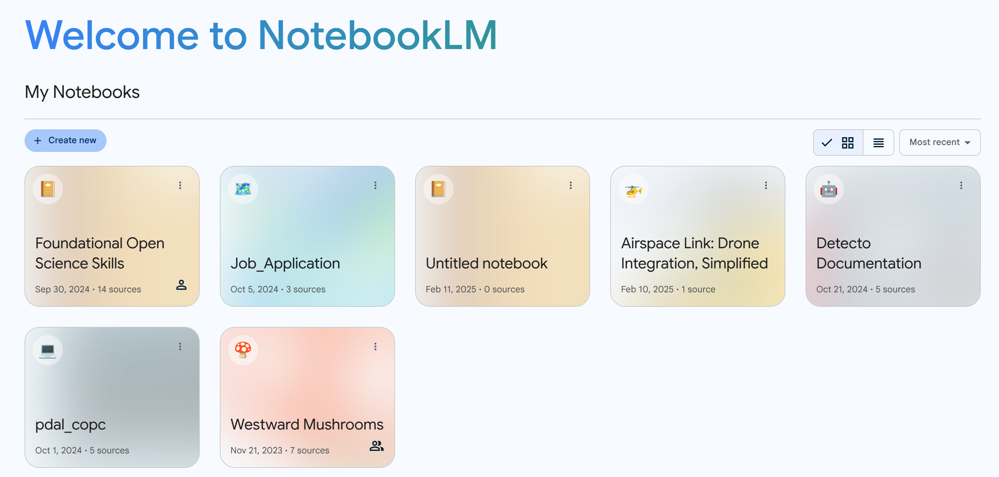

# Google NotebookLM

{width=300}

[Google NotebookLM](https://notebooklm.google/){target=_blank} is an AI tool specifically designed for research, writing, and education. What makes it unique amongst all the chatbots out in the world, is that the tool is restricted to only the resources you give it. This puts guardrails on your conversations and prevents the chatbot from presenting information with unknown sources. **If you want to work directly with just the sources you trust, NotebookLM is a great choice.** 

## Key Features & Limitations

* **Organization**

    The user interface is a bit different than most chatbots. NotebookLM is organized around the concept of a _notebook_. A _notebook_ is a digital container where resources for a single topic live. You could have a notebook for a class you are teaching or a notebook for a research paper literature review. 

{width=1000}

* **Accepted Source Formats**

    PDFs, .txt, markdown, audio (e.g., mp3), html text from a website, text transcripts from Youtube videos. You can drag and drop files or upload files from Google Drive. 
 

* **Conversation Bounds**

    The conversations you have with the chatbot will just be about the sources you provide. You cannot talk about random topics outside of your resources. You also cannot have the chatbot search the internet. 

* **Designed Specifically for Language**

    NotebookLM is designed for reading and writing. It does not analyze quantitative data. 

* **Inline Citations**

    Any answered questions or responses will include citations showing you exactly where the information came from.

* **Conversations are Ephemeral but Notes are Permanent**

    If you would like generated text to persist between session, save them as notes. 

* **Share your Notebook**

    Just like a Google Doc, users can share the notebook with anyone with different levels of permission. 

* **Audio Overview** {width=50}

    For any notebook you create, users have the option to create an audio overview of the content. This consists of a podcast style media where two hosts talk intelligently about the content. The quality of the AI generated podcast may surprise you!

 
{width=1100}

## Usage Ideas

**Research Uses:**

  * **Literature Reviews:**  Upload research papers, articles, and conference proceedings. NotebookLM can quickly identify key themes, summarize findings, and highlight gaps in the existing literature, significantly speeding up the literature review process.
  * **Data Analysis:**  Analyze qualitative data like interview transcripts or open-ended survey responses by identifying patterns, themes, and key quotes.
  * **Hypothesis Generation:**  Explore connections between different research sources and brainstorm new research questions or hypotheses based on synthesized knowledge.
  * **Grant Proposal Writing:**  Organize background research, synthesize relevant literature, and identify key arguments to strengthen grant proposals.
  * **Staying Up-to-Date:** Researchers can continuously upload new publications in their field and use NotebookLM to stay informed about the latest advancements and emerging trends.

 

**Education/Teaching Uses:**

  * Teachers can create a notebook that includes all the material for a given class (syllabus, schedule, lecture notes, textbook chapters, research articles)
  * The teacher can share the notebook with all the students with read-only permission. 
  * Teachers can generate quizes on the notebook content.
  * Students have an LLM chatbot restricted to just the course content where they can ask it any questions related to the class. 

 

**General Productivity:**

  * Use NotebookLM to help you customize your resume and cover letter for a specific job posting
  * **Meeting Preparation:** Upload meeting agendas, pre-reads, and background documents. NotebookLM can summarize key discussion points, identify action items, and prepare you for productive meetings. 

## NotebookLM Plus

Like most Google products, NotebookLM has a freemium model where the tool is available for free to anyone, but with limitations. Power users can get NotebookLM Plus for a subscription fee. Please check the technical documentation for how to get [NotebookLM Plus](https://support.google.com/notebooklm/answer/15678219).

