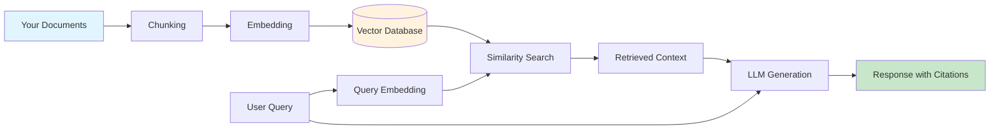
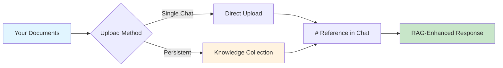

# Retrieval Augmented Generation (RAG)

<a rel="license" href="http://creativecommons.org/licenses/by/4.0/"></a><br />This work is licensed under a <a rel="license" href="http://creativecommons.org/licenses/by/4.0/">Creative Commons Attribution 4.0 International License</a>.

## What is RAG?

**Retrieval-Augmented Generation (RAG)** is a technique that enhances AI language models by giving them access to external knowledge sources. Instead of relying solely on what a model learned during training, RAG allows AI to retrieve relevant information from your own documents, databases, or knowledge bases and use that information to generate more accurate, up-to-date, and contextually relevant responses.

!!! info "Why RAG Matters"
    Large language models (LLMs) have a knowledge cutoff date and can sometimes generate plausible-sounding but incorrect information ("hallucinations"). RAG addresses these limitations by:

    - **Grounding responses** in your actual documents and data
    - **Providing citations** so you can verify information
    - **Keeping knowledge current** without retraining the model
    - **Maintaining privacy** by keeping sensitive data in your own systems

### RAG vs. Traditional AI Chat

| Aspect | Traditional LLM | RAG-Enhanced LLM |
|--------|----------------|------------------|
| Knowledge source | Training data only (static) | Training data + your documents (dynamic) |
| Currency | Limited to training cutoff | Can access current information |
| Accuracy | May hallucinate facts | Grounded in retrieved sources |
| Citations | Usually none | Can cite specific sources |
| Customization | Generic responses | Tailored to your domain |
| Privacy | Data may be used for training | Your data stays private |

### Real-World Examples of RAG

You may already be using RAG without realizing it:

- **[NotebookLM](notebooklm.md)**: Google's research tool uses RAG to answer questions based only on your uploaded sources
- **ChatGPT with file uploads**: When you upload PDFs, ChatGPT retrieves relevant sections to answer your questions
- **Claude Projects**: Custom knowledge bases that Claude references during conversations
- **[OpenWebUI](https://openwebui.com){target=_blank}**: Self-hosted interface with Knowledge collections for local, private RAG
- **Enterprise search tools**: Company wikis and knowledge bases that use AI to find and synthesize information
- **Legal research platforms**: AI tools that search case law and statutes to answer legal questions

## How RAG Works

RAG operates through a pipeline that connects your documents to the AI model. Understanding this pipeline helps you use RAG tools more effectively and troubleshoot when responses aren't what you expect.

### The RAG Pipeline



**Step-by-step explanation:**

1. **Document Ingestion**: Your documents (PDFs, web pages, databases) are loaded into the system
2. **Chunking**: Documents are split into smaller, manageable pieces (chunks)
3. **Embedding**: Each chunk is converted into a numerical representation (vector) that captures its meaning
4. **Storage**: Vectors are stored in a specialized database optimized for similarity search
5. **Query Processing**: When you ask a question, your query is also converted to a vector
6. **Retrieval**: The system finds chunks whose vectors are most similar to your query
7. **Generation**: The LLM generates a response using both your question and the retrieved context
8. **Citation**: The response includes references to the source documents

### Embeddings

Text passages (or other data, like images) are transformed into numerical representations known as "embeddings." These embeddings capture semantic meaning, so similar concepts end up being close together in vector space.

??? Info "Understanding Embeddings"

    [What are Embeddings? - Vicki Boykis](https://vickiboykis.com/what_are_embeddings/){target=_blank} - [download PDF :fontawesome-regular-file-pdf:](https://raw.githubusercontent.com/veekaybee/what_are_embeddings/main/embeddings.pdf)

    Embeddings are a way to represent data (words, images, etc.) as numerical vectors in a multi-dimensional space. These vectors capture semantic relationships between data points, meaning similar items are located closer together in the embedding space.

    Embedded space for geospatial applications:

    <blockquote class="twitter-tweet"><p lang="en" dir="ltr">Visualizing how embeddings can organize satellite imagery. Millions of points covering the state of Alabama move between their geographic position and their location in the embedding space. <a href="https://t.co/Z6FtoMQ84B">pic.twitter.com/Z6FtoMQ84B</a></p>&mdash; Caleb Kruse (@clkruse) <a href="https://twitter.com/clkruse/status/1658131846121803777?ref_src=twsrc%5Etfw">May 15, 2023</a></blockquote> <script async src="https://platform.twitter.com/widgets.js" charset="utf-8"></script>

    Embedded space for natural language:

    [Credit: Stephen Wolfram](https://writings.stephenwolfram.com/2023/02/what-is-chatgpt-doing-and-why-does-it-work/){target=_blank}

    [](https://writings.stephenwolfram.com/2023/02/what-is-chatgpt-doing-and-why-does-it-work/)

    **Why are Embeddings Important?**

    *   **Semantic Search:** Embeddings enable semantic search, where you can find information based on meaning rather than just keyword matching. "Car" and "automobile" will be close together even though they share no letters.
    *   **Machine Learning:** Embeddings are essential for training machine learning models, as they provide a way to represent complex data in a format that algorithms can understand.
    *   **Recommendation Systems:** Embeddings help power recommendation systems by identifying items with similar characteristics.
    *   **Data Visualization:** Embeddings can be used to visualize relationships between data points in a lower-dimensional space.

### Vector Databases

A vector database stores embeddings efficiently, using specialized data structures to handle large-scale, high-dimensional searches. Unlike traditional databases that match exact values, vector databases find the most semantically similar items to your query.

**Table: Popular RAG Vector Database Software**

| Platform | Type | Best For | Documentation |
|----------|------|----------|---------------|
| [Pinecone](https://www.pinecone.io/){target=_blank} | Managed (Serverless) | Production RAG apps with minimal DevOps; teams wanting fully managed infrastructure | [Pinecone Docs](https://docs.pinecone.io/){target=_blank} |
| [Weaviate](https://weaviate.io/){target=_blank} | Open Source / Managed | Hybrid search (vector + keyword); multimodal data (text, images) | [Weaviate Docs](https://weaviate.io/developers/weaviate){target=_blank} |
| [Qdrant](https://qdrant.tech/){target=_blank} | Open Source / Managed | Cost-sensitive workloads; edge deployments; powerful filtering | [Qdrant Docs](https://qdrant.tech/documentation/){target=_blank} |
| [Milvus](https://milvus.io/){target=_blank} / [Zilliz](https://zilliz.com/){target=_blank} | Open Source / Managed | Billion-scale vector search; enterprise teams with data engineering resources | [Milvus Docs](https://milvus.io/docs){target=_blank} |
| [Chroma](https://www.trychroma.com/){target=_blank} | Open Source | Prototyping and development; small to medium applications; easy local setup | [Chroma Docs](https://docs.trychroma.com/){target=_blank} |

??? tip "Choosing a Vector Database"

    - **Pinecone**: Best if you want a fully managed, serverless solution with minimal operational overhead. Query times often under 50ms.
    - **Weaviate**: Ideal for hybrid search combining vector similarity with keyword matching and metadata filtering in a single query.
    - **Qdrant**: Great balance of performance and cost; compact footprint makes it suitable for resource-constrained environments.
    - **Milvus/Zilliz**: Choose when you need industrial-scale deployments with billions of vectors and have infrastructure expertise.
    - **Chroma**: Perfect for getting started quickly, prototyping RAG applications, and learning vector database concepts.

## Using RAG Without Code

You do not need to be a programmer to benefit from RAG. Several platforms provide RAG capabilities through user-friendly interfaces.

### Consumer-Friendly RAG Tools

| Tool | How to Access RAG | Best For |
|------|------------------|----------|
| **[NotebookLM](notebooklm.md)** | Upload sources to a notebook | Research, literature reviews, studying |
| **ChatGPT Plus** | Upload files or enable "Browse" | General document Q&A |
| **Claude Pro** | Create a Project with files | Long-form document analysis |
| **Gemini Advanced** | Upload files or connect Google Drive | Google Workspace integration |
| **Microsoft Copilot** | Access via Microsoft 365 | Enterprise documents |
| **[OpenWebUI](https://openwebui.com){target=_blank}** | Create Knowledge collections or upload files | Privacy-sensitive data, local/offline use |

!!! example "Try It: RAG with NotebookLM"

    1. Go to [NotebookLM](https://notebooklm.google/){target=_blank}
    2. Create a new notebook
    3. Upload 2-3 research papers on a topic you are studying
    4. Ask questions like:
        - "What are the main findings across these papers?"
        - "Where do these authors disagree?"
        - "Summarize the methodology used in each study"
    5. Notice how responses include citations to specific sources

### RAG with OpenWebUI

[OpenWebUI](https://openwebui.com){target=_blank} is an open-source, self-hosted web interface for running AI models locally. It provides built-in RAG capabilities that allow you to chat with your own documents while keeping all data on your own computer or server---ideal for sensitive research data or when you want complete control over your AI infrastructure.

??? info "What is OpenWebUI?"

    OpenWebUI is a user-friendly web interface that works with local language models (via [Ollama](https://ollama.com){target=_blank}) and cloud APIs (OpenAI, Anthropic, etc.). Key features include:

    - **Privacy-first**: All processing happens locally; your documents never leave your machine
    - **Model flexibility**: Use any Ollama model (Llama, Mistral, Phi, etc.) or connect to cloud APIs
    - **No subscription fees**: Free and open-source (though you need hardware to run local models)
    - **Institutional deployment**: Many universities run OpenWebUI instances for researchers

    If your institution provides an OpenWebUI instance, you may already have access. Check with your IT department or research computing group.

#### How RAG Works in OpenWebUI

OpenWebUI offers two complementary ways to use RAG:

1. **Quick Document Chat**: Upload files directly in a conversation using the `+` button or drag-and-drop
2. **Knowledge Collections**: Create reusable document libraries that persist across conversations



#### Step-by-Step: Creating a Knowledge Collection

Knowledge collections are the recommended approach for documents you will reference repeatedly, such as course materials, research literature, or project documentation.

**Step 1: Access the Knowledge Section**

1. Log into your OpenWebUI instance
2. Navigate to **Workspace** in the left sidebar
3. Select **Knowledge**

**Step 2: Create a New Knowledge Base**

1. Click **+ Create Knowledge** (or the `+` button)
2. Configure your knowledge base:
    - **Name**: Give it a descriptive name (e.g., "Climate Policy Papers 2024")
    - **Description**: Briefly describe the contents
    - **Access**: Choose **Private** for personal use or **Public** to share with others on your instance
3. Click **Create**

**Step 3: Add Documents**

1. Open your newly created knowledge base
2. Add documents by:
    - **Drag and drop** files directly into the window
    - Click **Add Content** and select files from your computer
    - Paste a **URL** to import web content
3. Supported formats include: PDF, TXT, Markdown, DOCX, CSV, and more
4. Wait for processing to complete (you will see a progress indicator)

**Step 4: Use Your Knowledge in Conversations**

1. Start a new chat
2. Type `#` to see available knowledge collections
3. Select your knowledge base from the dropdown
4. Ask questions---OpenWebUI will retrieve relevant context from your documents

!!! example "Try It: Chat with Research Papers"

    1. Create a knowledge collection called "Literature Review"
    2. Upload 3-5 PDF papers related to your research
    3. In a new chat, type `#` and select your "Literature Review" collection
    4. Try these queries:
        - "What methodologies are used across these papers?"
        - "Summarize the key findings from each study"
        - "What gaps in the literature do these authors identify?"
    5. Notice how responses include citations showing which document provided each piece of information

#### Quick Document Upload (Per-Conversation)

For one-time document queries, you can upload files directly into a conversation:

1. Click the **+** button in the chat input area
2. Select **Upload Files** (or drag files directly into the chat)
3. Choose your document(s)
4. Once processed, reference them with `#` followed by the filename
5. Ask your questions

!!! tip "Quick Upload vs. Knowledge Collections"

    | Use Case | Recommended Method |
    |----------|-------------------|
    | One-time document analysis | Quick upload in chat |
    | Recurring reference materials | Knowledge collection |
    | Course readings for a semester | Knowledge collection |
    | Reviewing a paper before a meeting | Quick upload in chat |
    | Lab protocols and documentation | Knowledge collection |

#### Web Content in RAG

OpenWebUI can also retrieve content from web pages:

1. In the chat input, type `#` followed by a URL
2. Example: `#https://www.nature.com/articles/s41586-024-00001-1`
3. OpenWebUI will fetch, parse, and index the page content

!!! warning "Web Retrieval Tips"

    - Link to **reader-friendly** or **raw text** versions when available (web pages often contain navigation menus, footers, and ads that add noise)
    - Some sites block automated fetching---if retrieval fails, download the content and upload it instead
    - For academic papers, downloading the PDF typically yields better results than fetching the publisher's web page

#### OpenWebUI RAG Best Practices

**Document Preparation**

- Use **text-based PDFs** whenever possible (not scanned images)
- **Descriptive filenames** help you identify documents when using `#` references
- For long documents, consider whether the entire document is relevant or if excerpts would be better
- **Markdown files** often index more cleanly than complex PDFs

**Chunking Configuration** (Administrators)

If you manage an OpenWebUI instance, you can tune RAG performance in **Admin Panel > Settings > Documents**:

- **Chunk Size**: Larger chunks preserve more context but may dilute relevance
- **Chunk Overlap**: Higher overlap prevents important information from being split across chunks
- **Markdown Header Splitting**: Enable this for structured documents to keep sections together

**Query Strategies**

- Be specific: "What does Section 3.2 say about sampling methods?" works better than "Tell me about methods"
- Ask for citations: "Include the source for each claim"
- For complex questions, break them into parts and ask sequentially
- If results seem incomplete, try rephrasing---different wording retrieves different chunks

#### Comparison: OpenWebUI vs. Other RAG Tools

| Feature | OpenWebUI | NotebookLM | ChatGPT (Plus) | Claude Projects |
|---------|-----------|------------|----------------|-----------------|
| **Cost** | Free (self-hosted) | Free | $20/month | $20/month |
| **Data Privacy** | Full local control | Google servers | OpenAI servers | Anthropic servers |
| **Model Choice** | Any Ollama/API model | Gemini only | GPT-4 only | Claude only |
| **Setup Complexity** | Requires installation | None | None | None |
| **Persistent Collections** | Yes | Yes (Notebooks) | Limited | Yes (Projects) |
| **Offline Use** | Yes (local models) | No | No | No |
| **Best For** | Privacy-sensitive data, technical users | Research, studying | General use | Long documents |

### OpenAI's Vector Store and File Search

[OpenAI Platform](https://platform.openai.com/docs/overview){target=_blank} allows developers and advanced users to upload data to a [vector store](https://platform.openai.com/docs/api-reference/vector-stores){target=_blank} and enable [file search](https://platform.openai.com/docs/assistants/tools/file-search){target=_blank} in custom assistants. This provides more control over the RAG process compared to simple file uploads.

## Building RAG Applications

For researchers and developers who want more control, building custom RAG applications enables:

- Processing large document collections
- Customizing retrieval strategies
- Integrating with existing systems
- Maintaining full data privacy

### RAG Frameworks

Several frameworks simplify building RAG applications:

| Framework | Language | Description |
|-----------|----------|-------------|
| [LangChain](https://python.langchain.com/){target=_blank} | Python, JavaScript | Most popular RAG framework with extensive integrations |
| [LlamaIndex](https://www.llamaindex.ai/){target=_blank} | Python | Specialized for connecting LLMs with data sources |
| [Haystack](https://haystack.deepset.ai/){target=_blank} | Python | Production-ready NLP framework with RAG support |
| [Semantic Kernel](https://learn.microsoft.com/semantic-kernel/){target=_blank} | Python, C#, Java | Microsoft's SDK for AI orchestration |

??? example "Simple RAG with LangChain (Python)"

    This example demonstrates the core RAG workflow using LangChain:

    ```python
    from langchain_community.document_loaders import PyPDFLoader
    from langchain.text_splitter import RecursiveCharacterTextSplitter
    from langchain_openai import OpenAIEmbeddings, ChatOpenAI
    from langchain_community.vectorstores import Chroma
    from langchain.chains import RetrievalQA

    # 1. Load your documents
    loader = PyPDFLoader("research_paper.pdf")
    documents = loader.load()

    # 2. Split into chunks
    text_splitter = RecursiveCharacterTextSplitter(
        chunk_size=1000,
        chunk_overlap=200
    )
    chunks = text_splitter.split_documents(documents)

    # 3. Create embeddings and store in vector database
    embeddings = OpenAIEmbeddings()
    vectorstore = Chroma.from_documents(chunks, embeddings)

    # 4. Create a retrieval chain
    llm = ChatOpenAI(model="gpt-4")
    qa_chain = RetrievalQA.from_chain_type(
        llm=llm,
        chain_type="stuff",
        retriever=vectorstore.as_retriever()
    )

    # 5. Ask questions
    response = qa_chain.invoke("What are the main findings?")
    print(response)
    ```

    **Note**: This requires API keys and Python packages. See [Code Execution](execution.md) for environment setup.

## RAG for Academic Research

RAG is particularly valuable for academic work where accuracy, citations, and working with large document collections are essential.

### Use Cases in Research

**Literature Reviews**

- Upload dozens or hundreds of papers to a RAG system
- Ask synthesis questions: "How has methodology evolved in this field?"
- Identify gaps: "What aspects of this topic are under-researched?"
- Find contradictions: "Where do researchers disagree?"

**Grant Writing**

- Create a knowledge base of successful grant proposals
- Query for specific section examples: "Show me aims page structures"
- Synthesize background literature for significance sections

**Data Analysis Support**

- Upload codebooks, documentation, and methodology papers
- Ask questions about variable definitions and procedures
- Get help interpreting statistical results in context

**Teaching Preparation**

- Build a knowledge base of textbook chapters and supplementary materials
- Generate quiz questions based on specific content
- Create study guides that reference source materials

### Best Practices for Academic RAG

!!! success "Maximizing RAG Quality"

    **Document Preparation**

    - Use high-quality OCR for scanned documents
    - Ensure PDFs are text-based, not image-only
    - Include metadata (titles, authors, dates) when possible
    - Organize documents logically before upload

    **Querying Strategies**

    - Be specific: "According to Smith et al. (2023)..." vs. "What do researchers say..."
    - Ask for citations: "Include page numbers in your response"
    - Break complex questions into parts
    - Verify AI-provided citations against original sources

    **Quality Control**

    - Always verify critical facts against source documents
    - Check that citations actually support the claims made
    - Be aware that retrieval may miss relevant passages
    - Use multiple queries to cross-check important information

## Limitations and Considerations

RAG is powerful but not perfect. Understanding its limitations helps you use it appropriately.

### Technical Limitations

- **Chunk boundaries**: Important information split across chunks may not be retrieved together
- **Retrieval quality**: The system may not always find the most relevant passages
- **Context window limits**: Very long retrieved passages may be truncated
- **Embedding quality**: Some specialized vocabulary may not embed well

### Practical Considerations

- **Garbage in, garbage out**: Poor quality documents produce poor quality responses
- **Not a replacement for reading**: RAG helps you navigate documents, not avoid reading them
- **Citation verification required**: AI may misattribute or misquote sources
- **Domain expertise still matters**: You need expertise to evaluate response quality

!!! warning "Important Caveats"

    - RAG reduces but does not eliminate hallucination
    - Retrieved context may be incomplete or biased toward certain documents
    - Complex reasoning across many sources remains challenging
    - Always verify citations and facts for high-stakes applications

## Assessment Questions

??? question "What problem does RAG solve that traditional LLMs cannot?"

    !!! success "Answer"

        RAG addresses several key limitations of traditional LLMs:

        1. **Knowledge currency**: LLMs have a training cutoff date; RAG can access current documents
        2. **Hallucination**: LLMs may generate plausible but false information; RAG grounds responses in actual sources
        3. **Domain specificity**: LLMs have general knowledge; RAG can incorporate your specialized documents
        4. **Citations**: LLMs cannot cite sources; RAG can reference specific documents
        5. **Privacy**: With RAG, your documents can stay on your own systems rather than being sent for training

??? question "Explain the role of embeddings in RAG systems"

    !!! success "Answer"

        Embeddings are numerical representations of text that capture semantic meaning. In RAG:

        1. Document chunks are converted to embedding vectors during indexing
        2. User queries are converted to embedding vectors at query time
        3. Similar vectors indicate similar meaning (even with different words)
        4. The system finds document chunks with vectors closest to the query vector
        5. This enables "semantic search" - finding relevant content based on meaning, not just keywords

        For example, a query about "vehicle maintenance" would retrieve documents about "car repair" because their embeddings are similar, even though the words differ.

??? question "What factors affect the quality of RAG responses?"

    !!! success "Answer"

        Several factors influence RAG quality:

        **Document Quality**

        - Text extraction quality (OCR accuracy)
        - Document completeness and organization
        - Relevance to expected queries

        **Chunking Strategy**

        - Chunk size (too small loses context, too large dilutes relevance)
        - Chunk overlap (prevents splitting important passages)
        - Respecting document structure

        **Retrieval**

        - Number of chunks retrieved
        - Embedding model quality
        - Similarity threshold settings

        **Generation**

        - LLM capability and context window
        - Prompt design for using retrieved context
        - Temperature and other generation parameters

??? question "True or False: RAG eliminates the need to verify AI responses"

    !!! failure "False"

        RAG reduces but does not eliminate the need for verification:

        - Retrieved passages may not be the most relevant
        - The LLM may misinterpret or misquote retrieved content
        - Important context may be split across chunks not retrieved together
        - Citations should always be verified against original sources
        - Domain expertise is still needed to evaluate response quality

        RAG provides better grounding and traceability, but critical applications still require human verification.

## Further Resources

### Documentation and Guides

- [:simple-langchain: LangChain RAG Tutorial](https://python.langchain.com/docs/tutorials/rag/){target=_blank}
- [:simple-ollama: LlamaIndex Getting Started](https://developers.llamaindex.ai/){target=_blank}
- [:material-pine-tree: Pinecone RAG Guide](https://docs.pinecone.io/guides/get-started/rag-guide){target=_blank}

### Academic Papers

- [Retrieval-Augmented Generation for Knowledge-Intensive NLP Tasks](https://arxiv.org/abs/2005.11401){target=_blank} - The original RAG paper (Lewis et al., 2020)
- [A Survey on Retrieval-Augmented Text Generation](https://arxiv.org/abs/2202.01110){target=_blank} - Comprehensive survey of RAG techniques

### Related Workshop Content

- **[NotebookLM](notebooklm.md)** - Consumer-friendly RAG for research
- **[Text Mining](text_mining.md)** - Techniques for processing large text collections
- **[Code Execution](execution.md)** - Setting up environments for custom RAG development
- **[Agentic AI](agentic.md)** - How RAG combines with autonomous AI agents
