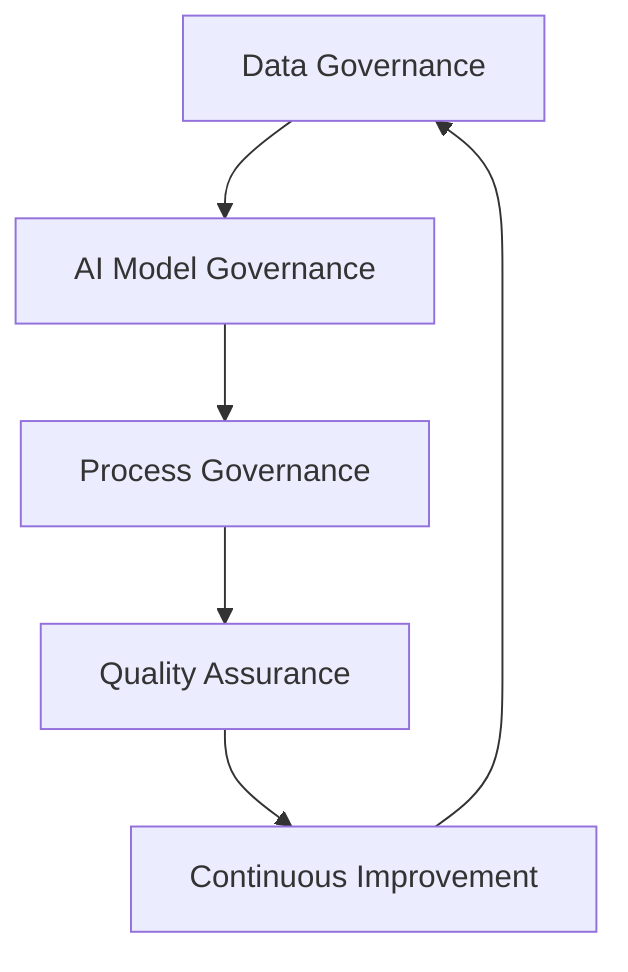

# Public Health 

<a rel="license" href="http://creativecommons.org/licenses/by/4.0/"></a><br />This work is licensed under a <a rel="license" href="http://creativecommons.org/licenses/by/4.0/">Creative Commons Attribution 4.0 International License</a>.

## [:material-run-fast: Bias and Data Quality](../../bias.md)

## [:material-run-fast: Ethics: Transparency & Accountability](../../transparency.md)

## Standardization 

### AI-Powered Protocol Standardization in Public Health

Standardization of protocols and controls is critical for ensuring consistent, high-quality public health practices across different organizations and regions. AI can significantly enhance this process while maintaining human oversight and expertise.

#### Using AI for Protocol Standardization

**1. Protocol Analysis and Harmonization**

AI can analyze multiple existing protocols to identify commonalities, differences, and best practices:

```markdown
Example Prompt for Protocol Analysis:
"Analyze these 5 different COVID-19 testing protocols from various health departments. 
Identify:
- Common required steps across all protocols
- Key differences in methodology
- Best practices that appear in multiple protocols
- Potential gaps or missing elements
- Recommendations for a standardized protocol"
```

**2. Natural Language Processing for Protocol Extraction**

AI can extract structured information from unstructured protocol documents:

- Convert narrative guidelines into step-by-step procedures
- Identify required equipment, materials, and personnel
- Extract critical values, thresholds, and decision points
- Create standardized terminology mappings

**3. Automated Protocol Validation**

AI systems can check protocols for:
- Completeness (all necessary steps included)
- Consistency (no contradictory instructions)
- Compliance with regulations and standards
- Evidence-based practice alignment

#### Human-in-the-Loop (HITL) Approaches

Human-in-the-loop systems combine AI efficiency with human expertise to improve accuracy and reliability:

**1. Review and Validation Workflow**
```
AI Draft → Human Expert Review → AI Revision → Expert Approval → Implementation
```

**2. Key HITL Components:**

- **Expert Annotation**: Subject matter experts review and annotate AI-generated protocols
- **Iterative Refinement**: AI learns from expert corrections to improve future outputs
- **Decision Points**: Critical decisions require human approval before proceeding
- **Quality Assurance**: Random sampling and human verification of AI outputs

**3. Practical Implementation Example:**

```python
# Pseudo-code for HITL protocol standardization
def standardize_protocol_with_human_review(raw_protocols):
    # Step 1: AI initial analysis
    ai_draft = ai_analyze_protocols(raw_protocols)
    
    # Step 2: Human expert review
    expert_feedback = request_expert_review(ai_draft)
    
    # Step 3: AI incorporates feedback
    revised_protocol = ai_revise_with_feedback(ai_draft, expert_feedback)
    
    # Step 4: Final human approval
    if expert_approves(revised_protocol):
        return finalized_protocol
    else:
        return iterate_revision_process()
```

#### Building Robust AI Infrastructure

A robust AI infrastructure for public health protocol standardization requires:

**1. Technical Architecture Components:**

- **Data Management Layer**
  - Secure storage for sensitive health data
  - Version control for protocol iterations
  - Audit trails for all changes
  - HIPAA-compliant data handling

- **AI Processing Layer**
  - Natural language processing models
  - Machine learning pipelines
  - Real-time validation engines
  - Integration APIs for existing systems

- **Human Interface Layer**
  - Intuitive review interfaces
  - Collaborative annotation tools
  - Decision tracking dashboards
  - Mobile access for field workers

**2. Governance Framework:**



**3. Key Infrastructure Requirements:**

- **Scalability**: Handle increasing protocol volumes and complexity
- **Interoperability**: Connect with existing health information systems
- **Security**: Protect sensitive health information
- **Reliability**: 99.9% uptime for critical health operations
- **Traceability**: Complete audit trails for regulatory compliance

**4. Implementation Considerations:**

- **Change Management**: Training staff on new AI-assisted workflows
- **Ethical Guidelines**: Ensuring AI decisions are fair and unbiased
- **Regulatory Compliance**: Meeting local and federal health regulations
- **Performance Monitoring**: Tracking AI accuracy and human satisfaction
- **Continuous Learning**: Regular model updates based on new evidence

#### Real-World Application Example

**Standardizing Contact Tracing Protocols Across States:**

1. **Input**: 50 different state contact tracing protocols
2. **AI Analysis**: Identifies core components, variations, and best practices
3. **Human Review**: Epidemiologists review AI recommendations
4. **Standardized Output**: Unified protocol with state-specific adaptations
5. **Implementation**: Rolled out with training and monitoring
6. **Feedback Loop**: Continuous improvement based on field experience

#### Best Practices for Implementation

1. **Start Small**: Pilot with non-critical protocols first
2. **Maintain Transparency**: Document AI decision-making processes
3. **Preserve Expertise**: AI augments, not replaces, human judgment
4. **Regular Audits**: Systematic review of AI performance
5. **Stakeholder Engagement**: Include all users in design and testing
6. **Continuous Training**: Keep both AI models and humans updated

Human-in-the-loop approaches that improve accuracy and reliability, combined with robust AI infrastructure, allow for more seamless integration into public health practices while maintaining the critical human oversight necessary for healthcare decision-making. 

## Case Studies end Examples

#### Awesome Lists

[](https://github.com/sindresorhus/awesome?tab=readme-ov-file#health-and-social-science){target=_blank}

[ Awesome Healthcare](https://github.com/kakoni/awesome-healthcare#readme){target=_blank}

[ Awesome Healthcare Datasets](https://github.com/geniusrise/awesome-healthcare-datasets){target=_blank}

### Diagnostics

AI has great promise for enhancing diagnostic capabilities, but have exhibited [biases on race and ethnicity](https://www.nytimes.com/2021/03/15/technology/artificial-intelligence-google-bias.html){target=_blank}. There are calls to address these biases in big data and AI for health care by taking an [open science approach](https://pmc.ncbi.nlm.nih.gov/articles/PMC8515002/){target=_blank}

* AI-enabled pulse oximeters overstate blood oxygen saturation in individuals with darker skin, [exacerbating racial bias](https://www.aclu.org/news/privacy-technology/algorithms-in-health-care-may-worsen-medical-racism){target=_blank}

* AI techniques for detecting skin cancer have lower accuracy on dark skin.

### Disease Surveillance & Prediction

AI-powered predictions change the landscape of population-level public health surveillance. 

Machine learning (predictive AI) has been used for many years to analyze data and make predictions around [disease spread and outbreak detection](https://www.preprints.org/manuscript/202504.1250/v1){target=_blank}. 

AI-systems can quickly analyze electronic health records (EHRs), social media platforms, online search queries, environmental data, genomic sequences, wearable devices, 

| Application Area | AI Technique(s) Used | Data Sources Leveraged | Specific Examples/Platforms | Key Outcomes/Impacts |
| --- | --- | --- | --- | --- | 
| Early Outbreak Detection | Machine Learning, NLP | Social Media, News Reports, Airline Travel Data, Official Health Reports | [BlueDot](https://bluedot.global/){target=_blank}, [HealthMap](https://www.healthmap.org/en/){target=_blank} | Early warning for COVID-19, Zika; faster public health response | 
| Real-Time Monitoring | Machine Learning | EHRs, Lab Reports, Public Health Data | Various research models, hospital surveillance systems | Continuous tracking of disease spread and intensity | 
| Epidemic Forecasting | Machine Learning, Deep Learning | Historical Disease Data, Climate Patterns, Population Mobility, Search Queries | [Google Flu Trends (deprecated)](https://en.wikipedia.org/wiki/Google_Flu_Trends), [CDC FluSight](https://www.cdc.gov/flu-forecasting/data-vis/current-week.html){target=_blank}, [Dengue/Influenza prediction models](https://doi.org/10.1038/s41598-025-85437-w){target=_blank} | Improved prediction accuracy for flu seasons, dengue outbreaks; better preparedness | 
| Identifying High-Risk Populations | Machine Learning | Demographic, Socioeconomic, Health Data | Models for predicting vulnerability to specific diseases or severe outcomes | Enables targeted interventions and resource allocation to most vulnerable groups |
| Pathogen Genomic Surveillance | AI Algorithms, Machine Learning | Genomic Sequences of Pathogens | Systems for analyzing viral/bacterial genomes | Rapid detection of new variants (e.g., SARS-CoV-2), understanding transmissibility/virulence changes |
| Syndromic Surveillance (Unconv.) | NLP, Machine Learning | Online Search Queries (symptoms), Social Media Posts (symptom mentions) | Google Flu Trends, models analyzing Twitter/Facebook data | Early detection of community transmission before clinical reporting |
| Antimicrobial Resistance (AMR) Tracking | Predictive Analytics, ML | Clinical Data, Epidemiological Data, Lab Results | AI-driven AMR surveillance systems | Improved detection of AMR trends, rapid pathogen ID and resistance profiling, guidance for stewardship |
| Vector-Borne Disease Prediction | Machine Learning | Environmental Data (temp, humidity, rainfall), Satellite Imagery, Historical Case Data | AI models for Malaria, Dengue, Zika prediction | Prediction of high-risk areas for outbreaks, enabling targeted vector control measures |
| Resource Allocation Prediction | Machine Learning | Outbreak Data, Hospital Capacity Data, Supply Chain Information | Models forecasting demand for medical supplies, beds, personnel | Optimization of resource deployment during public health emergencies | 
| Misinformation Monitoring | NLP | Social Media Content, Online News | AI tools tracking health-related misinformation | Identification of false narratives that could impede public health responses, enabling counter-messaging |


* [Zeng et al. (2021) Artificial intelligence–enabled public health surveillance—from local detection to global epidemic monitoring and control. Artificial Intelligence in Medicine Technical Basis and Clinical Applications](https://doi.org/10.1016/B978-0-12-821259-2.00022-3){target=_blank}

* [Hattab, G. et al. (2025) The Way Forward to Embrace Artificial Intelligence in Public Health. American Journal of Public Health 115, 123_128](https://doi.org/10.2105/AJPH.2024.307888){target=_blank}

### Resource Allocation

Perhaps the most ethically fraught application of AI in health care is on resource allocation. Decisions made by algorithms for high-risk care have exhibited racial biases. 

* Training data based on historical spending for health care on black vs white patients resulted in an algorithm systematically biased toward spending on more on white patients than on black patients, resulting in a perpetuation and exacerbation of the health disparity. 

### Clinical Decision Support


[Google's TxGemma](https://developers.googleblog.com/en/introducing-txgemma-open-models-improving-therapeutics-development/){target=_blank}, a collection of language models aimed at helping pharmaceutical companies with drug discovery.

TxGemma understands and predicts the properties of therapeutic entities — throughout the entire discovery process, from identifying promising targets to helping predict clinical trial outcomes. 

[https://deepmind.google/models/gemma/txgemma/](https://deepmind.google/models/gemma/txgemma/)

[Google's Articulate Medical Intelligence Explorer (AMIE)](https://research.google/blog/amie-a-research-ai-system-for-diagnostic-medical-reasoning-and-conversations/){target=_blank} A research AI system for diagnostic medical reasoning and conversations

* [Tu et al. (2024) Towards Conversational Diagnostic AI](https://doi.org/10.48550/arXiv.2401.05654){target=_blank}


### Mental Health

Unregulated AI is dangerous to the mental health of vulnerable populations. AI has been accused of contributing to individuals suicide, exacerbating distress, and cyberbullying. Unlicensed and unaccountable [AI chatbots are posing as therapists](https://www.nytimes.com/2025/02/24/health/ai-therapists-chatbots.html).

AI therapy companies are proliferating, but [there is little oversight](https://www.apaservices.org/practice/business/technology/artificial-intelligence-chatbots-therapists). Evidence of AI therapy effectiveness on mental health is still forthcoming, but some [early research](https://ai.nejm.org/doi/abs/10.1056/AIoa2400802){target=_blank} suggest AI may become a valuable tool and [help to mitigate national and rural provider shortages](https://www.nytimes.com/2025/04/15/health/ai-therapist-mental-health.html){target=_blank}. 

* [Heinz et al. (2025) Randomized Trial of a Generative AI Chatbot for Mental Health Treatment. NEJM AI 2025;2(4)](https://ai.nejm.org/doi/full/10.1056/AIoa2400802){target=_blank}

* [Thakkar et al. (2024) Artificial Intelligence in positive mental health: a narrative review. Front Digit Health. 2024 Mar 18;6:1280235](https://doi.org/10.3389/fdgth.2024.1280235){target=_blank}


## Further Reading


[WHO Guidance: Ethics and Governance of Artificial Intelligence for Health](https://iris.who.int/bitstream/handle/10665/341996/9789240029200-eng.pdf){target=_blank}

[Focus Group on "Artificial Intelligence for Health" (FG-AI4H)](https://www.itu.int/en/ITU-T/focusgroups/ai4h/Pages/default.aspx){target=_blank}