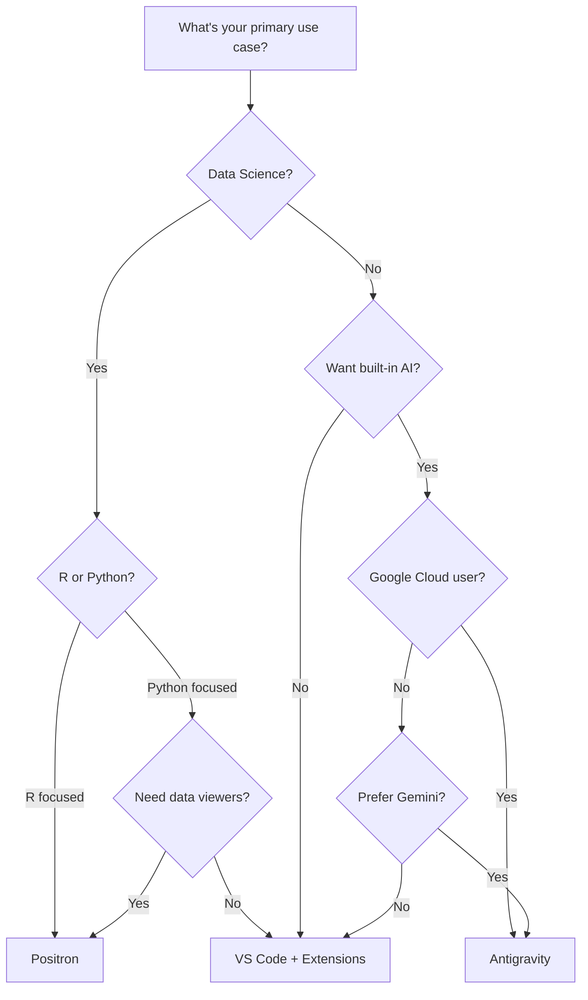

# :material-microsoft-visual-studio-code: Visual Studio Code and AI-Powered Development

<a rel="license" href="http://creativecommons.org/licenses/by/4.0/"></a><br />This work is licensed under a <a rel="license" href="http://creativecommons.org/licenses/by/4.0/">Creative Commons Attribution 4.0 International License</a>.

## Overview

[Visual Studio Code](https://code.visualstudio.com/){target=_blank} (VS Code) has become the world's most popular code editor, used by over 70% of developers worldwide. Its extensibility, cross-platform support, and vibrant ecosystem make it an ideal foundation for AI-powered development workflows.

This guide covers:

- **VS Code installation** on all major platforms
- **Alternative VS Code-based IDEs** (Positron, Google Antigravity)
- **AI coding extensions** (Claude Code, GitHub Copilot, Cline, Roo Code, and more)
- **Local AI integration** with Ollama
- **Practical workflows** for academic users

!!! tip "Why VS Code for AI-Assisted Coding?"

    VS Code offers unique advantages for AI-powered development:

    - **Extensive AI extension ecosystem** - Choose from dozens of AI assistants
    - **Integrated terminal** - Run AI-generated code without leaving the editor
    - **Multi-file editing** - AI tools can understand and modify entire projects
    - **Git integration** - Version control your AI-assisted work
    - **Free and open-source** - No licensing costs for the base editor
    - **Cross-platform** - Same experience on Windows, macOS, and Linux

---

## 1. Installing Visual Studio Code

### Windows

=== "Windows Installer (Recommended)"

    1. Download the [VS Code installer](https://code.visualstudio.com/download){target=_blank} for Windows
    2. Run the downloaded `.exe` file
    3. Follow the installation wizard:
        - Accept the license agreement
        - Choose the installation location (default is recommended)
        - Select additional tasks:
            - :material-checkbox-marked: Add "Open with Code" to context menu
            - :material-checkbox-marked: Register Code as an editor for supported file types
            - :material-checkbox-marked: Add to PATH (important for command-line use)
    4. Click **Install** and then **Finish**

=== "Windows Package Manager (winget)"

    ```powershell
    # Install VS Code via winget
    winget install Microsoft.VisualStudioCode

    # Verify installation
    code --version
    ```

=== "Chocolatey"

    ```powershell
    # Install Chocolatey first if not installed
    # Then install VS Code
    choco install vscode

    # Verify installation
    code --version
    ```

### macOS

=== "Direct Download (Recommended)"

    1. Download [VS Code for macOS](https://code.visualstudio.com/download){target=_blank}
    2. Open the downloaded `.zip` file
    3. Drag **Visual Studio Code.app** to the **Applications** folder
    4. Launch VS Code from Applications or Spotlight
    5. (Optional) Add to Dock for quick access

    **Enable Command Line:**

    1. Open VS Code
    2. Press ++cmd+shift+p++ to open the Command Palette
    3. Type "shell command" and select **Shell Command: Install 'code' command in PATH**
    4. Now you can open files with `code filename.py` from Terminal

=== "Homebrew"

    ```bash
    # Install VS Code via Homebrew
    brew install --cask visual-studio-code

    # Verify installation
    code --version
    ```

### Linux

=== "Ubuntu/Debian (apt)"

    ```bash
    # Download and install the Microsoft GPG key
    wget -qO- https://packages.microsoft.com/keys/microsoft.asc | gpg --dearmor > packages.microsoft.gpg
    sudo install -D -o root -g root -m 644 packages.microsoft.gpg /etc/apt/keyrings/packages.microsoft.gpg

    # Add the VS Code repository
    sudo sh -c 'echo "deb [arch=amd64,arm64,armhf signed-by=/etc/apt/keyrings/packages.microsoft.gpg] https://packages.microsoft.com/repos/code stable main" > /etc/apt/sources.list.d/vscode.list'

    # Update and install
    sudo apt update
    sudo apt install code

    # Verify installation
    code --version
    ```

=== "Fedora/RHEL (dnf)"

    ```bash
    # Import the Microsoft GPG key
    sudo rpm --import https://packages.microsoft.com/keys/microsoft.asc

    # Add the VS Code repository
    sudo sh -c 'echo -e "[code]\nname=Visual Studio Code\nbaseurl=https://packages.microsoft.com/yumrepos/vscode\nenabled=1\ngpgcheck=1\ngpgkey=https://packages.microsoft.com/keys/microsoft.asc" > /etc/yum.repos.d/vscode.repo'

    # Install VS Code
    sudo dnf check-update
    sudo dnf install code

    # Verify installation
    code --version
    ```

=== "Snap"

    ```bash
    # Install VS Code via Snap
    sudo snap install code --classic

    # Verify installation
    code --version
    ```

=== "Flatpak"

    ```bash
    # Install VS Code via Flatpak
    flatpak install flathub com.visualstudio.code

    # Run VS Code
    flatpak run com.visualstudio.code
    ```

### Verify Installation

After installation, verify VS Code is working:

```bash
# Check VS Code version
code --version

# Open current directory in VS Code
code .

# Open a specific file
code myfile.py
```

---

## 2. Alternative VS Code-Based IDEs

Several alternative IDEs build on VS Code's foundation, offering specialized features for different workflows.

### Posit Positron

:simple-posit: **[Positron](https://github.com/posit-dev/positron){target=_blank}** is a next-generation data science IDE developed by Posit (formerly RStudio). Built on VS Code's foundation, it provides native support for Python and R with a data-science-focused interface.

**Key Features:**

| Feature | Description |
|---------|-------------|
| **Multi-language Console** | Switch between R and Python in the same session |
| **Variables Pane** | Inspect data frames, lists, and objects visually |
| **Data Viewer** | Explore large datasets with filtering and sorting |
| **Plot Pane** | View and export visualizations interactively |
| **VS Code Extensions** | Access the full VS Code extension marketplace |
| **Quarto Integration** | Native support for scientific publishing |

**AI Integration:**

Positron supports the same AI extensions as VS Code, plus Posit's own AI packages:

- **ellmer** (R) - Unified interface for 20+ LLM providers
- **chatlas** (Python) - LLM chat framework with streaming and tool calling

!!! info "See Full Installation Instructions"

    For detailed Positron installation instructions, see our [Posit (RStudio) guide](posit.md).

**Best For:** Data scientists, statisticians, R programmers, and researchers who need robust data exploration tools alongside AI assistance.

---

### Google Antigravity

:simple-google: **[Google Antigravity](https://antigravity.google/){target=_blank}** is Google's experimental AI-first code editor built on VS Code. It features deep Gemini integration for next-generation development workflows.

**What Makes Antigravity Different:**

- **Built-in Gemini AI Chat** - No extension installation required
- **Agentic Coding** - AI can run commands, edit files, and iterate on tasks
- **Google Cloud Integration** - Seamless connection to Google Cloud services
- **Experimental Features** - Early access to Google's latest AI capabilities

#### Installation

=== "macOS"

    **Apple Silicon (M1/M2/M3/M4):**

    1. Visit [antigravity.google/download](https://antigravity.google/download){target=_blank}
    2. Download the macOS ARM64 installer
    3. Open the downloaded `.dmg` file
    4. Drag **Antigravity** to your Applications folder
    5. Launch from Applications or Spotlight

    **Intel Mac:**

    1. Download the macOS x64 installer from the same page
    2. Follow the same installation steps

=== "Windows"

    1. Visit [antigravity.google/download](https://antigravity.google/download){target=_blank}
    2. Download the Windows installer (`.exe`)
    3. Run the installer and follow the setup wizard
    4. Launch Antigravity from the Start menu

=== "Linux"

    ```bash
    # Ubuntu/Debian
    # Download the .deb package from antigravity.google/download
    sudo dpkg -i antigravity-*.deb
    sudo apt-get install -f

    # Fedora/RHEL
    # Download the .rpm package
    sudo dnf install antigravity-*.rpm

    # Launch Antigravity
    antigravity
    ```

#### Using Antigravity's Built-in AI

Antigravity includes a built-in AI chat interface powered by Gemini:

1. **Open AI Chat:** Press ++ctrl+shift+i++ (Windows/Linux) or ++cmd+shift+i++ (macOS)
2. **Start Chatting:** Type your request in natural language
3. **Apply Suggestions:** AI can directly edit your code with your approval
4. **Run Commands:** The AI can execute terminal commands to test and verify changes

**Example Workflow:**

```
You: Create a Python script that reads a CSV file and generates a summary report

Antigravity AI: I'll create that for you. Let me:
1. Create a new file called csv_analyzer.py
2. Write the code using pandas for data analysis
3. Add error handling and documentation

[AI creates the file and shows preview]

Would you like me to run this script to test it?
```

**Authentication:**

- Sign in with your Google account when first launching Antigravity
- Gemini API usage is included (no separate API key needed for basic features)
- Google Cloud integration requires additional authentication

#### Antigravity vs VS Code

| Feature | VS Code | Antigravity |
|---------|---------|-------------|
| **Base Editor** | VS Code core | VS Code fork |
| **AI Assistant** | Extensions required | Built-in Gemini |
| **Pricing** | Free + extension costs | Free (Google account) |
| **Agentic Features** | Via extensions | Native support |
| **Extension Support** | Full marketplace | VS Code compatible |
| **Cloud Integration** | Via extensions | Native Google Cloud |
| **Stability** | Production-ready | Experimental |

!!! tip "When to Use Antigravity"

    **Choose Antigravity if:**

    - You want AI built-in without extension setup
    - You're already using Google Cloud services
    - You want to try Google's latest AI features
    - You prefer Gemini models for coding

    **Choose VS Code if:**

    - You need production stability
    - You want to choose your own AI provider
    - You need maximum extension compatibility
    - You prefer Claude, GPT, or other models

---

## 3. AI Extensions for VS Code

VS Code's extension marketplace offers numerous AI coding assistants. Here are the most powerful options:

### Claude Code (Anthropic)

:simple-anthropic: **[Claude Code](https://marketplace.visualstudio.com/items?itemName=anthropic.claude-code){target=_blank}** is Anthropic's official VS Code extension, bringing Claude's powerful coding abilities directly into your editor.

**Key Features:**

- Multi-file context awareness
- Inline code completion and suggestions
- Interactive chat panel for complex requests
- Terminal command generation and execution
- Git integration for version control assistance
- Support for Claude 4.5 Sonnet, Opus, and Haiku models

**Installation:**

1. Open VS Code
2. Press ++ctrl+shift+x++ (Windows/Linux) or ++cmd+shift+x++ (macOS) to open Extensions
3. Search for "Claude Code"
4. Click **Install** on the official Anthropic extension

**Setup:**

1. Click the Claude icon in the Activity Bar
2. Sign in with your Claude.ai account, or
3. Enter your Anthropic API key (get one at [console.anthropic.com](https://console.anthropic.com){target=_blank})

**Quick Start Example:**

```
Press Ctrl+Shift+P → "Claude: Open Chat"

You: Explain this function and suggest improvements

[Select code in editor]

Claude: This function calculates factorial recursively. Here's my analysis:
- Time complexity: O(n)
- Space complexity: O(n) due to call stack
- Issue: No handling for negative numbers

Suggested improvements:
[Claude provides refactored code with error handling]
```

!!! info "See Full Tutorial"

    For comprehensive Claude Code workflows, see our [Claude Code Tutorial](claude-code.md).

---

### GitHub Copilot

:octicons-copilot-16: **[GitHub Copilot](https://marketplace.visualstudio.com/items?itemName=GitHub.copilot){target=_blank}** is GitHub's AI pair programmer, offering real-time code suggestions as you type.

**Key Features:**

- Inline code completions (ghost text)
- Multi-line suggestions
- Context-aware from open files
- Support for dozens of programming languages
- GitHub Copilot Chat for conversational assistance

**Pricing:**

| Plan | Price | Features |
|------|-------|----------|
| **Individual** | $10/month | Code completions, chat |
| **Business** | $19/user/month | Team management, policy controls |
| **Enterprise** | $39/user/month | Advanced security, fine-tuning |
| **Free for Education** | $0 | Full access for verified students/educators |

!!! info "See Full Setup Instructions"

    For detailed GitHub Copilot setup, see our [GitHub Copilot guide](copilot.md).

---

### Cline (formerly Claude Dev)

:material-robot: **[Cline](https://marketplace.visualstudio.com/items?itemName=saoudrizwan.claude-dev){target=_blank}** is an open-source VS Code extension that pioneered the "bring your own model" (BYOM) approach, allowing you to use any AI provider.

**Key Features:**

- Model-agnostic: Use Claude, GPT, Gemini, or local models
- Agentic capabilities: Can run commands and modify files
- MCP (Model Context Protocol) support
- Transparent pricing: Pay per API request
- Open-source and community-driven

**Installation:**

1. Open VS Code Extensions (++ctrl+shift+x++)
2. Search for "Cline"
3. Click **Install**

**API Key Setup:**

1. Open Cline settings (gear icon in Cline panel)
2. Select your provider:

=== "Anthropic (Claude)"

    1. Get API key from [console.anthropic.com](https://console.anthropic.com){target=_blank}
    2. Paste key in Cline settings
    3. Select model (Claude 4.5 Sonnet recommended)

=== "OpenAI (GPT)"

    1. Get API key from [platform.openai.com](https://platform.openai.com/api-keys){target=_blank}
    2. Paste key in Cline settings
    3. Select model (GPT-4o recommended)

=== "Google (Gemini)"

    1. Get API key from [aistudio.google.com](https://aistudio.google.com/apikey){target=_blank}
    2. Paste key in Cline settings
    3. Select model (Gemini 2.5 Pro recommended)

=== "Ollama (Local)"

    1. Ensure [Ollama](ollama.md) is running locally
    2. Select "Ollama" as provider in Cline
    3. Choose from your downloaded models
    4. No API key required

**Usage Example:**

```
Open Cline panel → Type your request

You: Create a REST API endpoint for user authentication using FastAPI

Cline: I'll create that for you. Here's my plan:
1. Create auth.py with login/logout endpoints
2. Add JWT token generation
3. Create user model and validation
4. Update main.py to include the router

[Cline shows file changes for approval]

Do you want me to apply these changes?
```

---

### Roo Code

:material-kangaroo: **[Roo Code](https://marketplace.visualstudio.com/items?itemName=RooVeterinaryInc.roo-cline){target=_blank}** is a fork of Cline focused on rapid feature development and customization.

**Key Features:**

- All Cline features plus experimental capabilities
- Custom model presets and configurations
- Advanced prompt customization
- Frequent updates with new features
- Community-driven development

**Installation:**

1. Open VS Code Extensions
2. Search for "Roo Code" or "Roo Cline"
3. Click **Install**
4. Configure API keys same as Cline

**Best For:** Users who want cutting-edge features and don't mind occasional instability.

---

### ChatGPT / CodeGPT Extensions

:fontawesome-brands-openai: Several extensions bring OpenAI's GPT models to VS Code:

**[CodeGPT](https://marketplace.visualstudio.com/items?itemName=DanielSanMedium.dscodegpt){target=_blank}** - Popular multi-provider extension

**Installation:**

1. Open VS Code Extensions
2. Search for "CodeGPT"
3. Click **Install**

**Setup:**

1. Open CodeGPT settings
2. Select "OpenAI" as provider
3. Enter your API key from [platform.openai.com](https://platform.openai.com/api-keys){target=_blank}
4. Select model (GPT-4o or GPT-4o-mini)

!!! info "OpenAI Account Setup"

    For detailed OpenAI account and API setup, see our [ChatGPT guide](chatgpt.md).

---

### Google Gemini Extensions

:simple-google: **[Gemini CLI Companion](https://marketplace.visualstudio.com/items?itemName=Google.gemini-cli-vscode-ide-companion){target=_blank}** brings Google's Gemini models to VS Code.

**Installation:**

1. Open VS Code Extensions
2. Search for "Gemini" (look for official Google extension)
3. Click **Install**

**Setup:**

1. Sign in with your Google account, or
2. Enter API key from [aistudio.google.com](https://aistudio.google.com/apikey){target=_blank}

!!! info "Google AI Account Setup"

    For detailed Gemini account setup, see our [Gemini guide](gemini.md).

---

## 4. AI Extension Comparison

| Extension | Provider | Pricing | Agentic | Local Models | Best For |
|-----------|----------|---------|---------|--------------|----------|
| [Claude Code](claude-code.md) | Anthropic | API or subscription | Yes | No | Full-stack development, documentation |
| [GitHub Copilot](copilot.md) | GitHub/OpenAI | $10-39/month | Limited | No | Inline completions, GitHub users |
| Cline | Multi-provider | API costs only | Yes | Yes (Ollama) | Budget-conscious, model flexibility |
| Roo Code | Multi-provider | API costs only | Yes | Yes (Ollama) | Experimental features |
| CodeGPT | Multi-provider | API costs only | Limited | Yes (Ollama) | Simple setup, multi-provider |
| Gemini Companion | Google | API or free tier | Limited | No | Google Cloud users |

!!! tip "Recommendation for Academic Users"

    **For beginners:** Start with GitHub Copilot (free for educators/students) for inline completions.

    **For research:** Use Cline with Ollama for privacy-sensitive work with local models.

    **For serious development:** Claude Code offers the best balance of capability and reliability.

---

## 5. Setting Up API Keys

### VS Code User Settings

Store API keys in VS Code settings for extension-specific configuration:

1. Press ++ctrl+comma++ (Windows/Linux) or ++cmd+comma++ (macOS)
2. Search for your extension name
3. Find the API key setting and enter your key

!!! warning "Security Note"

    API keys stored in VS Code settings are saved in plain text. For better security, use environment variables.

### Environment Variables

The most secure way to manage API keys:

=== "macOS/Linux"

    Add to your shell profile (`~/.bashrc`, `~/.zshrc`, or `~/.bash_profile`):

    ```bash
    # Anthropic Claude
    export ANTHROPIC_API_KEY="sk-ant-your-key-here"

    # OpenAI
    export OPENAI_API_KEY="sk-your-key-here"

    # Google AI
    export GOOGLE_API_KEY="your-key-here"

    # Reload your shell
    source ~/.zshrc  # or ~/.bashrc
    ```

=== "Windows (PowerShell)"

    ```powershell
    # Set for current session
    $env:ANTHROPIC_API_KEY = "sk-ant-your-key-here"
    $env:OPENAI_API_KEY = "sk-your-key-here"

    # Set permanently (user level)
    [System.Environment]::SetEnvironmentVariable("ANTHROPIC_API_KEY", "sk-ant-your-key-here", "User")
    ```

=== "Windows (System Settings)"

    1. Press ++win+r++, type `sysdm.cpl`, press Enter
    2. Click **Advanced** tab
    3. Click **Environment Variables**
    4. Under "User variables", click **New**
    5. Enter variable name (e.g., `ANTHROPIC_API_KEY`) and value

### Security Best Practices

!!! danger "Never Commit API Keys to Git"

    ```bash
    # Add to your .gitignore
    .env
    .env.local
    *.key
    ```

**Best Practices:**

1. **Use environment variables** instead of hardcoding keys
2. **Rotate keys regularly** (every 90 days recommended)
3. **Use separate keys** for development and production
4. **Set spending limits** in your provider dashboards
5. **Revoke compromised keys immediately**

---

## 6. Ollama Integration (Local Models)

Run AI models locally for privacy, offline access, and cost savings. See our full [Ollama guide](ollama.md) for installation.

### Extensions Supporting Ollama

| Extension | Ollama Support | Configuration |
|-----------|---------------|---------------|
| Cline | Native | Select "Ollama" provider |
| Roo Code | Native | Select "Ollama" provider |
| CodeGPT | Native | Select "Ollama" provider |
| Continue | Native | Add Ollama to config |

### Configuration Example (Cline)

1. Install and start [Ollama](ollama.md)
2. Pull a coding model:

    ```bash
    # Recommended for coding
    ollama pull codellama:13b

    # Or for general use
    ollama pull llama3.2:latest

    # Or for smaller machines
    ollama pull qwen2.5-coder:7b
    ```

3. In Cline settings:
    - Provider: **Ollama**
    - Model: Select from your downloaded models
    - Base URL: `http://localhost:11434` (default)

### Example Workflow

```bash
# Terminal: Start Ollama (if not running as service)
ollama serve

# In VS Code with Cline:
# 1. Open Cline panel
# 2. Ensure Ollama is selected as provider
# 3. Start coding!

You: Explain this Python decorator and add type hints

Cline (via local Codellama): [Provides explanation and modified code]
# All processing happens locally - no data leaves your machine
```

!!! tip "Model Recommendations for Coding"

    | Model | Size | RAM Needed | Best For |
    |-------|------|------------|----------|
    | `qwen2.5-coder:7b` | 4.7GB | 8GB | Fast coding on laptops |
    | `codellama:13b` | 7.4GB | 16GB | Balanced coding |
    | `deepseek-coder:33b` | 19GB | 32GB | Complex coding tasks |
    | `codestral:latest` | 12GB | 24GB | Multi-language coding |

---

## 7. Practical Examples

### Code Generation

**Request:**
```
Create a Python class for managing a bibliography with BibTeX import/export
```

**AI Response (via Claude Code):**
```python
import bibtexparser
from dataclasses import dataclass, field
from typing import List, Optional
from pathlib import Path

@dataclass
class BibEntry:
    """Represents a single bibliography entry."""
    entry_type: str
    cite_key: str
    title: str
    authors: List[str]
    year: int
    journal: Optional[str] = None
    volume: Optional[str] = None
    pages: Optional[str] = None
    doi: Optional[str] = None

class BibliographyManager:
    """Manage academic bibliography with BibTeX support."""

    def __init__(self):
        self.entries: List[BibEntry] = []

    def import_bibtex(self, filepath: Path) -> int:
        """Import entries from a BibTeX file."""
        with open(filepath) as f:
            bib_db = bibtexparser.load(f)

        for entry in bib_db.entries:
            self.entries.append(BibEntry(
                entry_type=entry.get('ENTRYTYPE', 'article'),
                cite_key=entry.get('ID', ''),
                title=entry.get('title', ''),
                authors=entry.get('author', '').split(' and '),
                year=int(entry.get('year', 0)),
                journal=entry.get('journal'),
                doi=entry.get('doi')
            ))

        return len(bib_db.entries)

    def export_bibtex(self, filepath: Path) -> None:
        """Export all entries to a BibTeX file."""
        # Implementation continues...
```

### Code Explanation

**Select code, then ask:**
```
Explain this regex pattern and suggest improvements for readability
```

**AI explains:**
```
This regex `r'^(?P<year>\d{4})-(?P<month>\d{2})-(?P<day>\d{2})$'` matches ISO date format:

- `^` - Start of string
- `(?P<year>\d{4})` - Named group "year": exactly 4 digits
- `-` - Literal hyphen
- `(?P<month>\d{2})` - Named group "month": exactly 2 digits
- `-` - Literal hyphen
- `(?P<day>\d{2})` - Named group "day": exactly 2 digits
- `$` - End of string

Suggested improvement for readability:
```python
DATE_PATTERN = re.compile(
    r'^'
    r'(?P<year>\d{4})'   # Year: 4 digits
    r'-'
    r'(?P<month>\d{2})'  # Month: 01-12
    r'-'
    r'(?P<day>\d{2})'    # Day: 01-31
    r'$',
    re.VERBOSE
)
```

### Debugging Assistance

**Paste error message:**
```
TypeError: 'NoneType' object is not subscriptable at line 45
```

**AI diagnosis:**
```
This error occurs when you try to access an index or key on a None value.

Looking at line 45: `result = data['key'][0]`

The issue is likely that `data['key']` returns None instead of a list.

Suggested fix:
```python
# Add defensive check
value = data.get('key')
if value is not None and len(value) > 0:
    result = value[0]
else:
    result = default_value  # or raise a more informative error
```

### Refactoring

**Request:**
```
Refactor this function to use list comprehension and add error handling
```

**Before:**
```python
def process_files(paths):
    results = []
    for path in paths:
        f = open(path)
        data = f.read()
        results.append(data.upper())
        f.close()
    return results
```

**After (AI refactored):**
```python
from pathlib import Path
from typing import List

def process_files(paths: List[str]) -> List[str]:
    """
    Read files and return their contents in uppercase.

    Args:
        paths: List of file paths to process

    Returns:
        List of file contents converted to uppercase

    Raises:
        FileNotFoundError: If any file doesn't exist
        PermissionError: If any file can't be read
    """
    results = []
    for path in paths:
        try:
            content = Path(path).read_text(encoding='utf-8')
            results.append(content.upper())
        except (FileNotFoundError, PermissionError) as e:
            raise type(e)(f"Error processing {path}: {e}") from e

    return results
```

---

## 8. Choosing the Right Tool

### IDE Selection Guide



### Extension Selection Guide

| If you need... | Use this... | Why |
|---------------|-------------|-----|
| Best inline completions | GitHub Copilot | Industry standard, fast, reliable |
| Strongest reasoning | Claude Code | Best for complex tasks, documentation |
| Maximum flexibility | Cline | Use any model, including local |
| Privacy/offline | Cline + Ollama | Everything runs locally |
| Google integration | Gemini extensions | Native Google Cloud support |
| Free option | Copilot (edu) or Cline + Ollama | No cost for students/educators |
| Experimental features | Roo Code | Cutting-edge capabilities |

### Combining Multiple Extensions

You can install multiple AI extensions and use them for different tasks:

1. **GitHub Copilot** - Always-on inline completions
2. **Claude Code** - Complex refactoring and documentation
3. **Cline + Ollama** - Privacy-sensitive or offline work

!!! tip "Avoiding Conflicts"

    If you have multiple AI extensions:

    - Disable inline completions in all but one extension
    - Use keyboard shortcuts to invoke specific assistants
    - Check for conflicting keybindings in VS Code settings

---

## 9. Troubleshooting

### Common Issues

??? question "Extension won't authenticate"

    **Symptoms:** "Invalid API key" or "Authentication failed" errors

    **Solutions:**

    1. Verify your API key is correct (no extra spaces)
    2. Check if your API key has expired
    3. Ensure you have sufficient credits/quota
    4. Try regenerating a new API key
    5. Check firewall/proxy settings aren't blocking requests

??? question "Slow or no responses"

    **Symptoms:** Long wait times or timeouts

    **Solutions:**

    1. Check your internet connection
    2. Verify the AI service isn't experiencing outages
    3. Try a different/faster model
    4. For Ollama: ensure you have enough RAM for the model
    5. Reduce context size (close unnecessary files)

??? question "Code suggestions are wrong or outdated"

    **Symptoms:** AI suggests deprecated APIs or incorrect syntax

    **Solutions:**

    1. Provide more context in your prompts
    2. Specify the language version explicitly
    3. Include relevant documentation links
    4. Use a more capable model
    5. Update the extension to latest version

??? question "Ollama models won't load"

    **Symptoms:** "Model not found" or memory errors

    **Solutions:**

    1. Verify model is downloaded: `ollama list`
    2. Check available RAM vs model requirements
    3. Try a smaller model
    4. Restart Ollama service
    5. Check Ollama logs: `ollama logs`

??? question "Extension conflicts"

    **Symptoms:** Multiple completions, keyboard shortcut issues

    **Solutions:**

    1. Disable inline suggestions in all but one extension
    2. Check keybindings: ++ctrl+k++ ++ctrl+s++
    3. Use Command Palette to invoke specific extensions
    4. Update all extensions to latest versions

---

## 10. Further Resources

### Official Documentation

- [VS Code Documentation](https://code.visualstudio.com/docs){target=_blank}
- [VS Code Extension API](https://code.visualstudio.com/api){target=_blank}
- [Positron Documentation](https://github.com/posit-dev/positron){target=_blank}
- [Google Antigravity](https://antigravity.google/docs){target=_blank}

### Workshop Guides

| Topic | Guide |
|-------|-------|
| Claude Code workflows | [Claude Code Tutorial](claude-code.md) |
| GitHub Copilot setup | [GitHub Copilot Guide](copilot.md) |
| OpenAI account setup | [ChatGPT Guide](chatgpt.md) |
| Google AI setup | [Gemini Guide](gemini.md) |
| Posit tools and Positron | [Posit Guide](posit.md) |
| Local AI with Ollama | [Ollama Guide](ollama.md) |
| Vibe coding overview | [Vibe Coding](vibe.md) |

### Community Resources

- [VS Code GitHub Discussions](https://github.com/microsoft/vscode/discussions){target=_blank}
- [Cline GitHub](https://github.com/cline/cline){target=_blank}
- [Ollama Discord](https://discord.gg/ollama){target=_blank}
- [r/vscode Subreddit](https://reddit.com/r/vscode){target=_blank}

!!! tip "Getting Started Checklist"

    1. :material-checkbox-blank-outline: Install VS Code (or Positron/Antigravity)
    2. :material-checkbox-blank-outline: Choose and install an AI extension
    3. :material-checkbox-blank-outline: Set up API keys securely
    4. :material-checkbox-blank-outline: Test with a simple coding request
    5. :material-checkbox-blank-outline: Explore additional extensions as needed
    6. :material-checkbox-blank-outline: Consider local models for privacy-sensitive work
